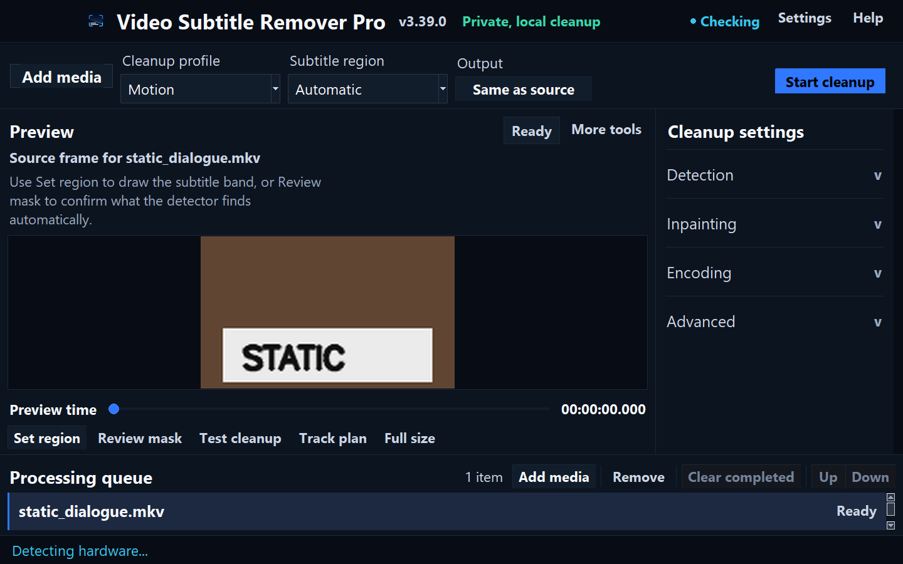
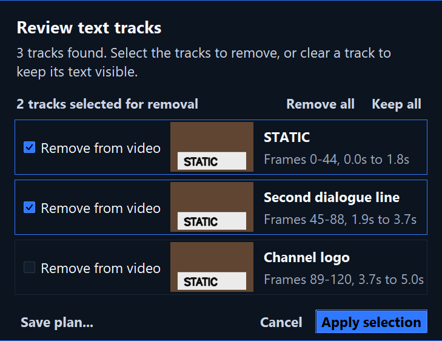
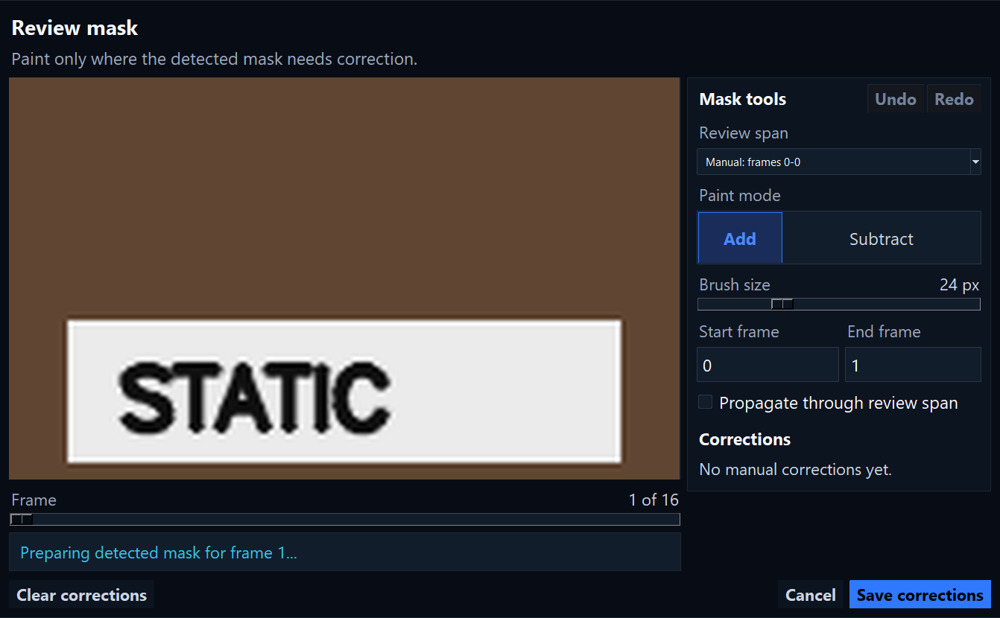
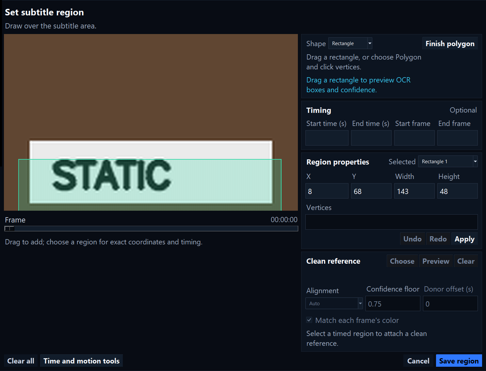
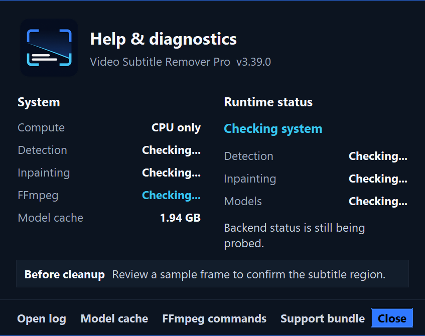

<p align="center">
  
</p>

<h1 align="center">Video Subtitle Remover Pro</h1>

<div align="center">


**Remove hard-coded subtitles locally with frame-aware cleanup and review tools**

[Features](#features) | [Installation](#installation) | [Usage](#usage) | [Configuration](#configuration) | [CLI](#cli-usage) | [Troubleshooting](#troubleshooting)

</div>

---

## Overview

Video Subtitle Remover Pro finds hard-coded subtitles and text watermarks, then rebuilds the covered pixels from surrounding frames or local inpainting models. It preserves the full frame instead of hiding text with a blur or crop.

All media processing is local. No account, subscription, or upload is required:
your video, images, masks, OCR text, and outputs stay on this computer. The
default OCR and cleanup path does not fetch models at runtime. Optional engines
can download model material after you enable them. Every such route is listed
under [Optional model network paths](#optional-model-network-paths) and in the
[privacy and network guide](docs/privacy-and-network.md).

The two non-model requests are an opt-in GitHub update check and
an opt-in crash report. The `update_check` setting is `false` by default.
Leave **Check for updates on startup** off to disable the update request. Crash
reporting is disabled unless both `VSR_GLITCHTIP_DSN` and
`VSR_CRASH_REPORTS=1` are set. Unset either variable, or set
`VSR_CRASH_REPORTS=0`, to disable it.

This project builds on [YaoFANGUK/video-subtitle-remover](https://github.com/YaoFANGUK/video-subtitle-remover). It adds a desktop review workflow, local LaMa inpainting, multiple detection engines, and a 52-code language picker backed by broader OCR engine coverage.

## Interface

The main workspace keeps the current frame, common review actions, cleanup settings, and processing queue in one view. Detailed controls stay available without covering the video.



Track selection says exactly what will be removed. Region and mask tools keep the media large while the controls stay grouped beside it.

| Track review | Mask correction |
|---|---|
|  |  |

| Region editor | Help and diagnostics |
|---|---|
|  |  |

## Features

- **Real Video Inpainting:** Temporal Background Exposure (TBE) reconstructs the true background from neighbouring frames where the subtitle is absent. No external model weight downloads required.
- **Real AI Inpainting:** LaMa neural network via ONNX Runtime (default, no torch dependency), OpenCV DNN weights, or an explicit PyTorch fallback opt-in
- **AUTO Inpaint Routing:** Scene-cut-aware routing between STTN and ProPainter mode using temporal exposure and measured motion
- **Multi-Engine Detection:** RapidOCR PP-OCRv6 (with PP-OCRv5 fallback comparison) through OpenCV 5 DNN, ONNX Runtime, or OpenVINO > PaddleOCR > Surya (GPL opt-in) > EasyOCR (frozen; last release 2024-09-24) > threshold fallback (automatic)
- **Truthful Named Stages:** Named OCR, inpainting, segmentation, tracking, and restoration requests stop with a classified error when the selected implementation cannot prove valid work. Missing visibility, malformed arrays, unchanged masks or pixels, and byte-identical restoration files are rejected before reports record success. Auto alone may try another implementation
- **Polygon-Aware OCR Masks:** OCR quadrilaterals stay attached to their legacy boxes through tracking, saved track plans, masks, and preview overlays, so rotated text doesn't widen removal to its full axis-aligned bounds
- **Stable SRT Export:** SRT sidecars reuse the text and confidence already attached to OCR tracks. Conservative Unicode-aware consensus absorbs low-confidence character jitter, keeps real caption changes separate, and writes the source frame clock without a second full-frame OCR pass
- **Lossless Pipeline:** FFV1 lossless intermediate (only the final encode is lossy) for noticeably cleaner outputs than the legacy mp4v intermediate
- **Exact Variable-Frame-Rate Timing:** FFmpeg 9 frame durations and integer PTS survive the final codec and audio mux, including a long final hold after constant PTS spacing; older packet-duration fields remain a compatibility fallback
- **Modern Codec Output:** Pick H.264 / H.265 / AV1 / VVC (H.266) from a dropdown; NVENC/QSV/AMF where available, libx265 / libsvtav1 software fallback, mask-aware film-grain restoration plus native SVT-AV1 film grain, and VVC when FFmpeg exposes `libvvenc`
- **Opt-in FFmpeg D3D12 Path:** FFmpeg 8.1+ can upload and scale frames with D3D12 and encode H.264/H.265 only after a byte-valid driver smoke; advertised-but-broken codecs and runtime failures fall back through NVENC/QSV/AMF and software
- **Precise Multi-region Masks:** Draw or select multiple rectangle/polygon regions, enter exact source-pixel coordinates and start/end seconds or frames, nudge with arrows, resize with Ctrl+arrows, and undo or redo edits
- **Moving Region Keyframes:** Scrub to two or more frames, draw rectangle or polygon anchors, and interpolate the mask deterministically through the selected motion span
- **Confidence-Gated Clean Plates and Donor Video:** Attach a same-size clean image or a whole donor release to each timed rectangle, preview translation or homography alignment and per-frame color matching, match donor frames by timestamp with a configurable offset, and fall back to normal inpainting whenever alignment is uncertain
- **Fade-Aware Masks:** Hold the nearest confident mask for a few frames on either side of a text track, so a subtitle that fades in or out is covered while it is still too faint for OCR to recognize; both holds reach across decode batches, so the result does not depend on where the decoder split the file
- **Last FFmpeg Commands:** Help shows the recent FFmpeg and ffprobe invocations as quoted, runnable lines you can copy, and the support bundle carries the same list, so an encode failure leaves something reproducible behind
- **Reviewable Track Plans:** Scan a file first and get every detected text track with its frame span, a text sample, and a thumbnail. Keep or remove each track before any pixel changes, save the plan as JSON, and reuse it from the CLI with `--plan-out` / `--plan-in`
- **Quality-Directed Mask Correction:** Review residual, flicker, and low-confidence frame spans; paint ordered add/subtract corrections with undo/redo; then rerun only the affected frames while reusing the prior cleaned output elsewhere
- **Lossless Matte Interchange:** Export exact gray8 FFV1 or PNG-sequence masks with CFR/VFR timestamps, edit them externally, preview replace/add/subtract composition, and import them through strict manifest preflight
- **Erase, Translate, and Re-embed:** Opt into one cleanup pass that accepts a translated SRT or sends OCR/Whisper/source-SRT cues to a pluggable local command, then burns the validated result with configurable ASS styling and hash-backed provenance
- **Inpaint Preview:** "Test cleanup" uses the selected video timestamp for single-frame modes and a scene-bounded before/current/after source window for temporal modes. The result reports its timestamp, frame range, and low-resolution planning proxy while inpainting the full-resolution source frame
- **Cached Mask Tuning:** Adjust mask dilation in the preview pane and see the composed result immediately without rerunning OCR
- **Clean Boundaries:** Gaussian alpha feathering at every inpaint boundary, with no visible cut lines
- **Language Support:** 52 selectable OCR language codes in the GUI, with installed OCR engines reporting broader capacity: RapidOCR 100+, PaddleOCR 106, Surya 90+ (GPL opt-in), and EasyOCR 80+; gettext catalogs in `locale/<BCP-47 tag>/LC_MESSAGES/vsr.mo` are packaged, preserve script/territory fallback, and follow the Windows interface locale
- **GPU Acceleration:** NVIDIA CUDA, AMD/Intel DirectML through ONNX Runtime, hardware-decode hints (D3D11 / VAAPI / MFX), CPU fallback
- **Subtitle Region Selector:** Scrub to any frame and draw one or more rectangles; saving activates the same complete mask in Auto, STTN, LaMa, and ProPainter, while Automatic keeps the saved shapes and adds OCR detections during processing, mask review, and cleanup previews
- **Live Region OCR Feedback:** While drawing a rectangle, inspect detected text boxes and confidence before saving the region
- **Selected-Language Masks:** Optionally remove only OCR boxes whose recognized script matches the chosen subtitle language, keeping unrelated on-screen text
- **Batch Processing:** Queue files or drag entire folders; per-item cancellation plus safe pause/resume for long videos
- **Multi-track Audio + Loudness Normalisation:** Pass through every audio track on Bluray rips; optional per-stream EBU R128 normalisation to LUFS targets (YouTube -14, Apple -16, broadcast -23)
- **Quality Self-Test**: PSNR / SSIM report, optional FFmpeg/libvmaf VMAF score, ROI-cropped metrics for the inpaint region, motion-compensated mask-local temporal evidence, outside-mask SDR or HDR color drift, and an optional side-by-side comparison PNG
- **Detection Efficiency Reports:** Batch summaries show frames OCR'd versus skipped, skip reasons, unique regions, stage timings, and an optimization hint when OCR dominates
- **HDR Color Validation:** Post-encode ffprobe checks record whether BT.2020/PQ/HLG and related color metadata were preserved in batch reports and output sidecars
- **CLI + Presets:** `python -m backend.processor --pattern ... --preset "YouTube (default)"`; nine built-in presets + user presets persisted to `%APPDATA%`
- **Chyron vs Subtitle Filter:** Keep persistent text (logos, lower-thirds) and remove dialogue, or vice versa
- **Karaoke Grouping:** Per-syllable boxes fuse into a single line mask so highlighted lyrics do not leak through the gaps
- **Live Preview During Processing:** 15 FPS throttled preview piped from the backend worker
- **Pre-batch ETA Estimate:** 30-frame detect probe seeds the ETA so users see "about X left" from the very first frame
- **Pause/Resume Checkpointing:** SHA-256 input fingerprint per file; finished files are skipped and paused videos resume from durable checkpoint frames
- **Backend Status:** Help shows OCR/inpaint backends, language picker vs. engine capacity, ONNX/OpenCV providers, required model files, hash state, FFmpeg capability profiles, and the next setup action
- **Premium Dark UI.** Media-first preview, fixed-width inspector, 14 to 15 px working text, compact command bar, quieter queue controls, and focused onboarding
- **Settings Persistence:** All knobs saved/restored between sessions; versioned schema with backfill migration
- **Release Tooling:** Local PyInstaller/NSIS build scripts, dependency checks, and support bundles

## System Requirements

| Component | Minimum | Recommended |
|-----------|---------|-------------|
| OS | Windows 10 | Windows 11 |
| CPU | Intel i5 / AMD Ryzen 5 | Intel i7 / AMD Ryzen 7 |
| RAM | 8 GB | 16+ GB |
| GPU | Any (CPU mode) | NVIDIA RTX 2060+ (RTX 50-series supported via CUDA 12.8) |
| VRAM | - | 6+ GB |
| Python | 3.11 | 3.12 or 3.13 for CUDA |

## Installation

### Prebuilt Download (no setup)

Grab the latest standalone Windows x64 build from the
[Releases page](https://github.com/SysAdminDoc/VideoSubtitleRemover/releases/latest):
download `VideoSubtitleRemoverPro-X.Y.Z-Windows-x64.zip`, extract anywhere, and run
`VideoSubtitleRemoverPro.exe` (or `Run_VSR_Pro.bat`). The build is unsigned, so
Windows SmartScreen may prompt. Choose **More info -> Run anyway**, and verify
the download against the published `SHA256SUMS.txt` file.

### Quick Install

1. **Download** or clone this repository
2. **Double-click** `Run_VSR_Pro.bat`. The first run automatically:
   - Creates a virtual environment
   - Detects your GPU and selects a named CPU, NVIDIA, or DirectML profile
   - Shows a compact six-stage setup splash while the runtime is prepared
   - Prints and installs every exact package required by that profile
   - Checks package versions, imports, dependency consistency, and one real
     inference on the claimed ONNX Runtime provider before launching
   - On later launches, runs the same verifier and repairs a broken `venv`
     without asking for input
   - Use `Run_VSR_Pro_Debug.bat` for a visible troubleshooting console, or
     `Run_VSR_Pro.ps1` when you prefer launching from PowerShell

Setup never treats a partial install as complete. A failure exits with a
nonzero code, prints a profile-specific repair command such as
`python setup.py --repair --profile cpu`, and keeps the last result in
`venv/.vsr-setup-report.json`.

### Windows Package Manager

This project does not currently publish a Windows Package Manager (winget)
manifest, so `winget install SysAdminDoc.VideoSubtitleRemoverPro` is not a
supported installation path. The supported path is the direct Windows x64 ZIP
download in [Prebuilt Download](#prebuilt-download-no-setup) above. The release
is unsigned: SmartScreen and Mark-of-the-Web can block first launch, and an
unattended winget upgrade would have no reliable way to clear that prompt.
If Windows blocks the downloaded executable, choose **More info -> Run
anyway** after verifying `SHA256SUMS.txt`.

### Manual Install

```powershell
cd VideoSubtitleRemover

# Create virtual environment
python -m venv venv
.\venv\Scripts\activate

# Choose a reviewed profile: cpu, nvidia, or directml.
$profile = "cpu"

# Install PyTorch. Python 3.12 or 3.13 is recommended for NVIDIA CUDA.
$torchIndex = if ($profile -eq "nvidia") { "https://download.pytorch.org/whl/cu128" } else { "https://download.pytorch.org/whl/cpu" }
pip install "torch>=2.11.0" "torchvision>=0.26.0" --constraint "dependency_profiles/$profile.txt" --index-url $torchIndex

# Install dependencies
pip install -r requirements.txt --constraint "dependency_profiles/$profile.txt"

# Install the profile's ONNX Runtime provider
$provider = @{ cpu = "onnxruntime"; nvidia = "onnxruntime-gpu"; directml = "onnxruntime-directml" }[$profile]
pip install $provider --constraint "dependency_profiles/$profile.txt"

# Verify exact versions, imports, dependency consistency, and provider inference
python -m backend.dependency_profiles verify --profile $profile

# Run
python VideoSubtitleRemover.py
```

`python setup.py --profile auto` selects the reviewed CPU, NVIDIA, or DirectML
profile from detected hardware. Pass a profile name explicitly for repeatable
installs and repairs. Setup prints the profile's exact required packages and
capabilities before it changes the environment. It writes a verified report
only after the same runtime verifier used by the launchers succeeds.
Maintainers update `dependency_profiles.json`, run
`python -m backend.dependency_profiles update`, review the emitted diffs, and
then run `python -m backend.dependency_profiles check`. Generated constraint
and manifest SHA-256 values are included in release evidence. PaddleOCR,
EasyOCR (frozen at 1.7.2; last release 2024-09-24) and legacy
`simple-lama-inpainting` (frozen at 0.1.2; last release 2023-07-28) remain
isolated opt-ins because their OpenCV wheel ownership or NumPy caps conflict
with the primary runtime. Prefer RapidOCR for maintained OCR and LaMa ONNX or
OpenCV 5 DNN for maintained inpainting.
Python 3.11 is the minimum supported interpreter because the security-reviewed
ONNX Runtime CPU/CUDA floor and pinned DirectML release do not provide Python
3.10 wheels.
The reviewed core NumPy lane pins 2.4.6 with a `<2.5.0` ceiling: 2.4.6 is the
newest 2.4.x line supporting Python 3.11, while NumPy 2.5.x requires Python
3.12 or newer. Keep the Python 3.11 floor and NumPy ceiling paired until the
next coordinated dependency review.

### FFmpeg (Required for audio)

```powershell
winget install ffmpeg
```

Use **FFmpeg 9.0.1 or newer.** VSR decodes untrusted media through FFmpeg,
and the 8.x series ended at 8.1.2 (2026-06-17) without the fixes for
CVE-2026-66037 (IAMF demuxer allocation), CVE-2026-66038 (LCL decoder heap
disclosure), CVE-2026-66039 (MACE6 decoder overflow), CVE-2026-64830 (VobSub
subtitle demuxer overflow) and CVE-2026-12706 (RASC use-after-free). Because
upstream closed those branches, no 8.x build can be patched in place and the
only remedy is moving to the 9.0 line. CVE-2026-58049 (RASC DLTA overflow) is fixed in FFmpeg 9.0.1; 8.x remains exposed because those branches closed without a backport.
Older branches are outside VSR's reviewed support policy; development
snapshots and future branches remain unknown until explicitly classified.
The self-test, support bundle, and strict release validation block
vulnerable, outdated, unsupported, and unknown runtimes.

**Build toolchain floors:** the local build requires **PyInstaller >= 6.22.2**
and the installer requires **NSIS >= 3.12** (elevated Low IL temp-directory
privilege-escalation hardening); `installer/vsr.nsi` fails to compile on an
older NSIS, and strict release validation flags both.

Two PyInstaller advisories set that floor, and they are not equally relevant.
CVE-2025-59042 (writable-CWD sys.path injection, fixed in 6.10.0) does apply
to this build. GHSA-9fxf-4qw3-ghmr (fixed in 6.22.1) does not: it concerns a
onefile build extracting into a world-writable temp directory, while
`VideoSubtitleRemoverPro.spec` produces a onedir distribution with an
`asInvoker` manifest. The floor sits at 6.22.2 as toolchain hygiene, and
release validation reports the second advisory as informational rather than
blocking so the distinction stays visible instead of becoming folklore.

Run `python -m backend.processor --self-test` to confirm the installed build's
`basic`, `advanced_quality`, `speech_fallback`, and `modern_codec` profiles.
Those profiles report missing filters such as `loudnorm`, `libvmaf`, or
`whisper`, missing encoders such as `libvvenc`, and OpenCV wheel ownership
before a long batch starts.

Run `python -m backend.cli --ocr-benchmark` to score the active OCR detector
(RapidOCR 3.9.2 defaults to PP-OCRv6) on synthetic ground-truth subtitle
fixtures --
detection recall plus per-frame latency, and print JSON evidence. Any change
to the default detector should be gated on the `meets_floors` verdict (recall
>= 0.8); latency is reported as device-dependent evidence, not a hard gate.
Use `--rapidocr-variant v5` for the retained PP-OCRv5 fallback, or
`--ocr-compare-variants` to benchmark both generations over the same fixtures
and receive one comparable JSON result.

Run `python -m backend.cli --inference-smoke` to prove the OCR and inpaint
backends actually execute: it pushes a generated text image and masked frame
through the detector and inpainter, printing the real engine / execution
provider (e.g. `RapidOCR`, `ONNX (CUDAExecutionProvider)`, or a `cv2`
fallback) and timing, and exits non-zero if a backend that loaded cannot run
inference. No model weights are downloaded; add `--gpu N` to test a CUDA
device.

### Validation

```powershell
venv\Scripts\python.exe -m pip install ruff==0.15.20
venv\Scripts\python.exe -m ruff check backend gui scripts VideoSubtitleRemover.py --no-cache
venv\Scripts\python.exe scripts/generate_cli_reference.py
venv\Scripts\python.exe scripts/i18n_catalogs.py check
venv\Scripts\python.exe -m pytest tests -q
venv\Scripts\python.exe -m backend.reference_corpus --json
venv\Scripts\python.exe tools/local_smoke.py
```

Use the project environment for the reference corpus. Its decoded-pixel hashes
are tied to the reviewed NumPy 2.4.6 and OpenCV 5.0.0.93 profile. The runner
stops with a repair command when another Python environment is active.

`build_exe.bat` is the fail-closed local release command. It runs the Ruff
source-hygiene gate and complete unit suite, builds the PyInstaller folder,
compiles the production NSIS
installer plus a non-elevated extraction runner, smoke-tests every frozen
entry point and the extracted installer payload, runs the reference corpus,
audits the exact frozen Python components with `pip-audit`, and applies strict
runtime/advisory gates. It exits nonzero at the first failed stage.

The default frozen profile packages RapidOCR/ONNX and excludes the
multi-gigabyte PaddleOCR, EasyOCR, and PyTorch fallbacks. Set
`VSR_ENABLE_FULL_OCR=1` and/or `VSR_ENABLE_PYTORCH_LAMA=1` before the build to
include those optional runtimes intentionally. `sbom.cdx.json` is derived from
PyInstaller's `Analysis-00.toc`: required Python libraries and hashed native
files reflect the folder that actually ships, while PyInstaller and other
build tools are marked with excluded scope. `release-verification.json` and
`pip-audit.json` record the remaining release proof. Strict evidence rejects
Torch through 2.5.1 for CVE-2025-32434 and through 2.9.1 for CVE-2026-24747.
Reviewed profiles stay on Torch 2.11.0 or newer.

Release evidence also records the external FFmpeg version and full build
configuration, plus OpenCV's wheel provenance and embedded `avcodec`,
`avformat`, and `avutil` ABI versions. Embedded ABI numbers are inventory data,
not upstream FFmpeg release tags. The release gate makes no embedded
vulnerability claim until a cited advisory maps an affected ABI range.

Quality reports keep the source surface and mask evidence in the work directory
while processing, then reopen the final encoded output before calculating the
mask-local temporal and outside-mask color gates. A severe valid frame pair is
reported by its timestamp and overlay instead of being diluted by a run mean.

Every release is staged as one atomic, version-derived artifact set. After
the strict gates pass, `backend.release_staging` copies the installer,
builds the portable ZIP from the frozen folder, copies the evidence set,
derives every filename from `APP_VERSION`, hashes exactly those files into
`SHA256SUMS.txt`, and promotes the whole directory to
`build/release/<version>/` in a single move. Evidence that records a
different version, a verification error, or a failed installer/launch smoke
is refused, and a promoted directory that gains or loses a file no longer
verifies, so a newer installer can never be published beside an older ZIP
or a checksum file that describes neither. Run
`python -m backend.release_staging verify --version X.Y.Z` to re-check a
staged set, and `... guidance` for the publication steps: upload the staged
set to a **draft** GitHub release, publish it, and keep immutable releases
enabled so a published tag's assets cannot be replaced. Artifacts are
intentionally UNSIGNED; `SHA256SUMS.txt` from the same staged set is the
only integrity reference.

The build pins `SOURCE_DATE_EPOCH` and `PYTHONHASHSEED` and records both
in the release evidence under `reproducibility`, so a rebuild starts from
the same envelope. Do not expect matching checksums: the frozen build
embeds its own absolute paths, so it is not path-invariant and an
identical rebuild in a different directory produces different bytes.
Rebuild verification is semantic. Compare the SBOM, the dependency
versions, and the bundled file list from the two evidence sets; the
checksums in `SHA256SUMS.txt` prove that a downloaded asset matches the
one that was published, which is a different question.

For an isolated CPU smoke without touching the Windows launcher, run the same
check in the local container recipe:

```powershell
docker build -t vsr-pro .
docker run --rm --mount "type=bind,source=$((Get-Location).Path)\inputs,target=/in,readonly" --mount "type=bind,source=$((Get-Location).Path)\outputs,target=/out" vsr-pro --input /in/movie.mp4 --output /out/movie_no_sub.mp4 --gpu -1 --no-audio
```

The image is pinned to the official Python 3.12 slim image by digest. It builds
FFmpeg 9.0.1 from the official source archive, verifies the archive SHA-256,
and checks both `ffmpeg` and `ffprobe` before the application layer is added.
It then installs the active CPU requirements under
`dependency_profiles/cpu.txt`, including RapidOCR and the reviewed ONNX Runtime
LaMa tier. The image runs the generated-image smoke during `docker build`, then
uses `python -m backend.cli` as its entrypoint. The input and output directories
in the example are mounted into the container. To run that smoke explicitly
after the build, bypass the CLI entrypoint:

```powershell
docker run --rm --entrypoint python vsr-pro tools/local_smoke.py --skip-self-test
```

## Usage

1. **Launch** via `Run_VSR_Pro.bat`, `Run_VSR_Pro_Debug.bat`, or
   `Run_VSR_Pro.ps1`
2. **Import:** Use **Add media** in the top command bar, press Ctrl+O, or
   drag media directly into the window
3. **Configure:** Choose the cleanup profile, subtitle region, and output
   location from the top command bar
4. **Open Advanced** in the right inspector when you need preset management,
   compute-device and language selection, workflow toggles, or expert tuning
5. **Inspect:** Select a queue item to preview it. Right-click the preview,
   or press **Menu / Shift+F10** while it is focused, to review the mask, test
   cleanup, compare before/after, or open the full-size view. You can also draw
   a fixed subtitle band directly on the preview. For video, use **Preview time**
   to choose a nonzero sample before running **Test cleanup**.
   The full selector supports exact rectangle or polygon coordinates,
   second/frame timing, arrow-key nudging, Ctrl+arrow resizing, and
   Ctrl+Z/Ctrl+Y history
6. **Process:** Use **Start cleanup** in the top command bar and monitor
   per-file status in the persistent queue. Remove, clear completed, and reorder
   controls stay in the queue header; Ctrl+L opens the detailed activity log

### Algorithm Comparison

| Algorithm | Inpainting Engine | Speed | Quality | Best For |
|-----------|-------------------|-------|---------|----------|
| **STTN** | Temporal Background Exposure | Fastest | Great | Live-action video with changing subtitles (default) |
| LAMA | Neural (LaMa ONNX/OpenCV DNN; PyTorch opt-in) | Medium | Best still-frame | Images, animations, static backgrounds |
| ProPainter | TBE + LaMa refinement | Slowest | Best motion | Motion-heavy footage, thick/decorative text |
| Auto | Per-scene STTN / ProPainter routing | Adaptive | Adaptive | Mixed edits with both static dialogue and fast motion |

> All three modes now do real inpainting. STTN recovers the literal background from adjacent frames where the subtitle is absent. This works because hard-coded subtitles are sparse in time, and the pixels behind them are revealed whenever the text changes or disappears. LAMA is a single-frame neural fill. ProPainter is a TBE + LaMa refinement hybrid. It is **not** the ICCV 2023 ProPainter model or weights (which carry a non-commercial NTU S-Lab license). This implementation uses only MIT-licensed code.

TBE also tests each exposed mask region for a semi-transparent overlay. When
the observed pixels fit the foreground/background mixture, it solves the
per-pixel opacity and recovers the clean background endpoint instead of
treating the region as an opaque binary hole. Opaque, poorly fitted, or
temporally unexposed regions keep the existing inpainting path; use
`--no-translucency` when a source needs the historical binary behavior.

For outlined or drop-shadowed glyphs, enable `--auto-dilate` (or the matching
Advanced > Detection toggle). It measures the local Lab-contrast falloff per
detected box, clamps the halo to 20 pixels, and uses a distance-transform edge
so the inpaint matte and final blend share one continuous boundary. An explicit
`--mask-dilate N` or a manual Mask dilate slider change disables auto mode for
that run.

### Detection Engines

The app automatically selects the best available engine. Advanced > Detection
can pin RapidOCR, OpenCV 5 DNN, PaddleOCR, Surya (GPL opt-in), EasyOCR
(frozen; last release 2024-09-24), any of the four vision-language tiers, or
the dependency-free OpenCV detector for comparison and reproducible runs.
If a pinned engine can't load or execute, processing stops with a classified
reason and repair instructions. Only Auto can continue with another OCR
implementation. The same selector is available as `--ocr-engine` on the
CLI, which accepts `auto`, `rapidocr`, `opencv-dnn`, `paddleocr`, `easyocr`,
`opencv`, `surya`, `vlm-florence2`, `vlm-qwen25vl`, `vlm-paddleocr-vl`, and
`vlm-paddleocr-vl-llama`.

Advanced > Detection also offers **Only remove the selected language**. It is
opt-in and requires recognized text from RapidOCR, PaddleOCR, or EasyOCR;
detection-only boxes are kept. Matching is by script family, so it can separate
Japanese/Cyrillic/Arabic/etc. overlays from Latin text, while Latin-script
languages such as English and French intentionally share one family.

Polygon-capable OCR engines also expose normalized vertices beside each
compatibility box. The processor expands and rasterizes each polygon locally,
and track plans and preview overlays keep those vertices instead of widening a
rotated caption to its bounding rectangle. Existing rectangle regions and old
track plans remain valid.

| Priority | Engine | Install | Languages | Notes |
|----------|--------|---------|-----------|-------|
| 1 | **RapidOCR 3.9.2** (OpenCV/ONNX/OpenVINO PP-OCRv6; PP-OCRv5 fallback) | `pip install "rapidocr==3.9.2"`; Intel: `pip install "openvino==2026.2.1" --constraint dependency_profiles/directml.txt` | 100+ | OpenCV 5 DNN is the dependency-light PP-OCRv6 CPU path; RapidOCR providers can compare v6 and v5 |
| 2 | PaddleOCR (reviewed opt-in) | `pip install "paddleocr==3.7.0" --constraint dependency_profiles/cpu.txt` in an isolated environment | 106 | Explicit PP-OCRv5 mobile (default, smaller/faster) or server models, or a PP-OCRv6 tier (`tiny`, `small`, `medium`) via `--paddleocr-variant`; installs its own OpenCV wheel |
| 3 | Surya | `pip install surya-ocr` | 90+ | Layout-aware (GPL) |
| 4 | EasyOCR (frozen) | `pip install "easyocr==1.7.2" --constraint dependency_profiles/cpu.txt` in an isolated environment | 80+ | Frozen legacy fallback; last release 2024-09-24; installs its own OpenCV wheel |
| 5 | OpenCV fallback | Built-in | Any | Threshold-based |

The vision-language tiers stay default-off and are picked the same way as
every other engine: choose one in Advanced > Detection or pass
`--ocr-engine vlm-florence2`, `vlm-qwen25vl`, `vlm-paddleocr-vl`, or
`vlm-paddleocr-vl-llama`. Picking one explains what it needs. A missing
dependency or runtime failure stops that request with repair guidance. Select
Auto when you want the automatic cascade. The `VSR_VLM_OCR=florence2` /
`VSR_VLM_OCR=qwen25vl` / `VSR_VLM_OCR=paddleocr-vl` environment variables
still work for scripted runs. For CPU/edge PaddleOCR-VL-1.5, start a local
llama.cpp OpenAI-compatible server with the GGUF model, then set
`VSR_PADDLEOCR_VL=1`; use `VSR_PADDLEOCR_VL_SERVER_URL` when the server is
not at `http://127.0.0.1:8080/v1`. HTTP is accepted only when every resolved
address is IPv4 or IPv6 loopback. Any endpoint outside this computer must use
HTTPS and also requires `VSR_ALLOW_REMOTE_VLM=1`. That acknowledgement means
the service receives full video frames as PNG images. URLs with credentials,
unsupported schemes, and redirects that cross the approved boundary are
blocked. `VSR_PADDLEOCR_VL_SKIP_SERVER_PROBE=1` skips only the health check;
it never skips the endpoint policy or the DNS check before a frame request.

Job reports and output sidecars record the requested implementation, the
provider that actually ran, and every execution observed. Auto also records
its ordered fallback chain. A requested inpainting, segmentation, tracking, or
restoration stage that can't run is recorded with a failure class and recovery
hint instead of being reported as successful unchanged output.

On NVIDIA systems, setup installs `onnxruntime-gpu>=1.26.0,<1.27.0` for the
tested CUDA 12.x ONNX Runtime path. ONNX Runtime 1.27 dropped CUDA 12 (its
default GPU wheel is now CUDA 13 only), so the pin caps below 1.27.0 to keep a
working CUDA 12 provider on a fresh install; CUDA 13 hosts install the cuda13
wheel manually per the ONNX Runtime install docs. ONNX Runtime `>=1.26.0` is
required for the CPU and CUDA packages. VSR runs untrusted OCR/inpaint ONNX
models through the runtime, and the self-test and strict release validation
flag older CPU/CUDA builds as a blocking security advisory.
Backend status and
release evidence distinguish `onnxruntime`, `onnxruntime-gpu`, CUDA package
channel, `onnxruntime-directml`, and the providers reported at runtime.
The reviewed dependency profiles track five execution-provider lanes with
separate tested and security state: CPU (`onnxruntime`), CUDA 12
(`onnxruntime-gpu` 1.26.x, the default NVIDIA lock), CUDA 13 (manual
cuda13 wheel, untested here), and DirectML, so the CPU lane can adopt
newer ONNX Runtime fixes while the CUDA 12 lane stays on its last
compatible build. TensorRT-RTX is listed as a separate untested manual lane;
it requires the `NvTensorRTRTXExecutionProvider` built-in provider or the
standalone EP ABI plugin and is not included in a frozen profile or live
benchmark. See the [official TensorRT-RTX provider notes](https://onnxruntime.ai/docs/execution-providers/TensorRTRTX-ExecutionProvider.html)
for the current installation and deprecation status.

| Provider lane | Execution provider | Profile / test state |
|---------------|--------------------|----------------------|
| CPU | `CPUExecutionProvider` | CPU profile; tested |
| CUDA 12 | `CUDAExecutionProvider` | NVIDIA profile; tested at 1.26.x |
| CUDA 13 | `CUDAExecutionProvider` | Manual lane; untested |
| DirectML | `DmlExecutionProvider` | DirectML profile; tested at 1.24.4 |
| TensorRT-RTX | `NvTensorRTRTXExecutionProvider` | Manual lane; untested; no live benchmark |

`python -m backend.dependency_profiles smoke --profile
<name>` creates one real inference session on the profile's claimed
provider and fails if ONNX Runtime silently falls back. Use the stricter
`verify` command shown above for a full environment check. It also checks
every exact required package, imports each runtime module, and runs `pip check`.
The source launchers use that command before starting the app.
Every supported environment installs `protobuf>=6.33.5` (CVE-2026-0994); older builds are
a blocking release advisory. On
AMD and Intel systems use the same deterministic DirectML core. Setup
preflights and installs the latest published and reviewed
DirectML wheel, `onnxruntime-directml==1.24.4`; incompatible Python/platform
combinations fail before the environment is changed and point to CPU or the
Windows ML audit. DirectML is in sustained engineering, with new Windows ONNX
Runtime feature development moving to Windows ML, so diagnostics and release
evidence report that lifecycle separately from CPU/CUDA security floors.
OpenVINO remains an optional Intel add-on and setup does not install it
silently. Install the reviewed version with
`pip install "openvino==2026.2.1" --constraint dependency_profiles/directml.txt`
if you want RapidOCR's
OpenVINO engine for CPU/iGPU OCR acceleration. OpenCV 5 DNN runs RapidOCR's
bundled PP-OCRv6 detection and recognition models on CPU without ONNX Runtime;
`python -m backend.cli --ocr-benchmark --ocr-engine opencv-dnn` records recall,
latency, and resident-memory evidence. Set `VSR_RAPIDOCR_ENGINE=opencv` to
force that path, `VSR_RAPIDOCR_ENGINE=onnxruntime` to force ONNX Runtime, or
`VSR_RAPIDOCR_ENGINE=openvino` to request OpenVINO explicitly. When ONNX
Runtime reports `DmlExecutionProvider`,
RapidOCR is initialized with its DirectML provider settings; unsupported
RapidOCR versions or missing providers fall back to CPU automatically.
OpenVINO initialization failures also fall back to ONNX Runtime. RapidOCR
3.9.2 exposes PP-OCRv6 by default; choose PP-OCRv5 with
`--rapidocr-variant v5` when running a regression comparison. RapidOCR 1.x/2.x
packages that do not expose the `OCRVersion` enum retain their package default.
legacy tuple output and current structured object/dict output are both
normalized to the same axis-aligned detector boxes.
Opt-in ONNX inpainters inspect their model `opset_import` metadata before
creating a DirectML session; if the default ONNX opset is newer than DirectML's
supported ceiling, VSR uses the CPU provider instead of failing at session
creation.
Windows ML is currently audit-only, not a replacement for ONNX Runtime
DirectML. Run `python -m backend.processor --audit-windows-ml` on Windows to
check whether the Python bridge, Windows App SDK bootstrap, ONNX Runtime EP
device catalog, and a tiny ONNX identity-model smoke run are available. Until
that probe passes on real user machines and the default OCR/inpaint models are
benchmarked through the Windows ML path, VSR keeps DirectML as the AMD/Intel
GPU route.

Optional model paths such as `VSR_LAMA_ONNX`, `VSR_MIGAN_ONNX`,
`VSR_FASTDVDNET`, `VSR_TRANSNETV2`, `VSR_VACE_CKPT_DIR`, and
`VSR_VIDEOPAINTER_CKPT_DIR`, and `VSR_FLOED_WEIGHTS` are checked against a
local adapter manifest before loading. Known SHA-256 mismatches fall back
instead of deserializing the file. Legacy adapters without a pinned hash still
run, but new strict adapters can require a known hash unless
`VSR_ALLOW_UNVERIFIED_MODELS=1` is set and recorded in release evidence.
Local release evidence also writes `release-advisories.json`; strict mode
blocks unallowed high/critical dependency advisories. The reviewed OpenCV
5.0.0.93 wheel bundles libpng 1.6.57, so older vulnerable OpenCV builds no
longer receive a release exception.
Wan2.1-VACE is available as an opt-in registry mode: set `VSR_VACE=1`, install
the reviewed upstream `vace` package, then either set `VSR_VACE_CKPT_DIR` to a
local `Wan-AI/Wan2.1-VACE-1.3B` snapshot or set `VSR_VACE_AUTO_FETCH=1` with
`huggingface-hub` installed. Auto-fetch is fixed to repository
`Wan-AI/Wan2.1-VACE-1.3B` at commit
`574e6a744642ce3bee319afc31496b88bde8aac4`. VSR downloads only the eight files
needed by the upstream VACE runtime and checks every SHA-256 before importing
or constructing the model. Repository or commit changes require a full
40-character commit plus `VSR_ALLOW_UNVERIFIED_MODELS=1`. Hash exceptions use
the same explicit flag. Both cases are marked unsafe in the model provenance
record, output sidecar, batch evidence, and support bundle.
VideoPainter is available only as a strict local research adapter: set
`VSR_VIDEOPAINTER=1`, review the upstream research/non-commercial and CogVideoX
license terms, set `VSR_VIDEOPAINTER_CKPT_DIR` to a local checkpoint root, set
`VSR_VIDEOPAINTER_COMMAND` to a local wrapper that accepts `--input-video`,
`--mask-video`, and `--output-video`, and opt in with
`VSR_ALLOW_UNVERIFIED_MODELS=1` for unpinned research weights.
FloED is available as a strict local research adapter: set `VSR_FLOED=1`, set
`VSR_FLOED_WEIGHTS` or `VSR_FLOED_CKPT_DIR` to a reviewed FloED checkpoint,
set `VSR_FLOED_COMMAND` to a local wrapper that accepts `--input-dir`,
`--mask-dir`, and `--output-dir`, and opt in with
`VSR_ALLOW_UNVERIFIED_MODELS=1` for unpinned research weights.
MatAnyone 2 is available as an opt-in mask refinement path for decorated or
thin subtitle masks: pass `--matanyone-refine`, set `VSR_MATANYONE=1`, install
the reviewed upstream `matanyone2` package, and set `VSR_MATANYONE_PATH` to a
local checkpoint or snapshot after reviewing the NTU S-Lab License 1.0 terms.
Unpinned PyTorch checkpoints require `VSR_ALLOW_UNVERIFIED_MODELS=1`; malformed
or missing alpha mattes fall back to the original OCR/SAM mask.
CoTracker3 can fill OCR-empty masks inside a video batch by propagating sparse
points from the nearest detected subtitle mask: pass `--cotracker-propagate`,
set `VSR_COTRACKER=1`, and set either `VSR_COTRACKER_REPO` to a reviewed local
co-tracker checkout or `VSR_COTRACKER_REF` to a full 40-character commit SHA
before any `torch.hub` load is allowed. Tags and branches are rejected because
they can move after review. Set `VSR_COTRACKER_MODE=online` only if you need
the online model; the default uses the offline CoTracker3 entrypoint.
VapourSynth `.vpy` input executes Python and therefore requires both
`VSR_VAPOURSYNTH=1` and `VSR_VAPOURSYNTH_SCRIPT_DIR` pointing to a reviewed
script directory. Scripts that resolve outside that directory are rejected,
including through symlinks.
NVIDIA users can request PyNvVideoCodec decode with `--decode-accel pynv`
or `--decode-accel nvdec` after installing NVIDIA's `PyNvVideoCodec` package.
The decoder uses GPU-backed surfaces when available, then converts to CPU BGR
frames for the current OpenCV/OCR/inpaint pipeline; missing packages or failed
opens fall back to software decode.
Smooth-background clips can trade precision for throughput with
`--rife-fast-stride N`: VSR inpaints keyframes every N frames, asks
Practical-RIFE to synthesize the skipped cleaned frames when `practical-rife`
is installed, and duplicates the nearer cleaned keyframe across scene cuts or
missing RIFE adapters.
The legacy `simple-lama-inpainting` PyTorch backend is frozen at 0.1.2 (last
release 2023-07-28) and disabled unless
`VSR_ENABLE_PYTORCH_LAMA=1` is set, because broken native torch wheels can
crash the GUI process during import. Its NumPy <2 cap also conflicts with the
primary OpenCV runtime, so use a separate legacy environment. Prefer the
maintained `VSR_LAMA_ONNX` or `VSR_OPENCV_LAMA` paths for automatic LaMa
acceleration.

### Optional model network paths

The default RapidOCR, OpenCV, TBE, and ONNX paths use installed or local files.
These are the runtime paths that may contact a model host after an explicit
opt-in or optional-engine selection:

| Optional path | What enables it | Download owner and cache |
|---|---|---|
| PaddleOCR | PaddleOCR is selected and its assets are absent | PaddleOCR manages its model URLs and user cache |
| EasyOCR | EasyOCR is selected and its assets are absent | EasyOCR manages its model URLs and user model cache |
| Surya | Surya is installed and `VSR_ALLOW_GPL=1` | Surya manages its Hugging Face models and cache |
| Florence-2 | `VSR_VLM_OCR=florence2` with `VSR_FLORENCE2_REVISION` | Hugging Face; a full commit is required because repository code executes |
| Qwen2.5-VL | `VSR_VLM_OCR=qwen25vl` with `VSR_QWEN25VL_REVISION` | Hugging Face; a pinned revision is required |
| simple-lama-inpainting | `VSR_ENABLE_PYTORCH_LAMA=1` and no local weight | The package manages the download; VSR checks the known `big-lama.pt` hash |
| Wan2.1-VACE-1.3B | `VSR_VACE_AUTO_FETCH=1` | Hugging Face; VSR pins the repository, full commit, and eight file hashes |
| faster-whisper | Whisper fallback uses a size name rather than a local path | faster-whisper manages its Hugging Face model and cache |
| MatAnyone 2 | `VSR_MATANYONE=1` with `VSR_MATANYONE_REVISION` | The adapter uses its configured remote model repository at a pinned revision |
| CoTracker3 | `VSR_COTRACKER=1` with a remote source | `torch.hub` fetches the reviewed GitHub repository at `VSR_COTRACKER_REF`, which must be a full commit |

PaddleOCR-VL through llama.cpp, FFmpeg Whisper, VideoPainter, and FloED require
local models or local wrapper commands. VSR does not auto-fetch those assets.
For a network-silent run, pre-populate the needed caches or configure local
paths, disable the update check and crash reporting, then disconnect the
machine. See [Privacy, network access, and offline use](docs/privacy-and-network.md)
for host details and verification behavior.

## CLI Usage

Process files from the command line:

```bash
python -m backend.processor -i input.mp4 -o output.mp4 -m lama --lang en --crf 20
```

For OCR-empty frames with speech, the optional Whisper fallback can
mask the bottom subtitle band. The default backend is `faster-whisper`;
FFmpeg 8 builds that include the `whisper` filter can instead use a
local whisper.cpp ggml model without Python ML dependencies:

```bash
python -m backend.processor -i input.mp4 -o output.mp4 --whisper-fallback --whisper-backend ffmpeg --ffmpeg-whisper-model C:\models\ggml-base.en.bin
```

The localization workflow can erase the original burned-in text and re-embed
a translated UTF-8 SRT in the same run. Supplying the translated captions is
the simplest deterministic path:

```powershell
python -m backend.processor -i input.mp4 -o localized.mp4 --translated-srt captions.es.srt --translation-style "FontSize=24,Outline=2"
```

To generate captions, provide a source SRT or let tracked OCR consensus supply
source cues. Engines that return only boxes use fallback recognition, followed
by an enabled Whisper fallback when OCR remains empty. VSR invokes the
selected command directly without a shell and sends one bounded JSON document
on stdin; VSR does not include or contact a translation service. The chosen
command controls how cue text is handled:

```powershell
python -m backend.processor -i input.mp4 -o localized.mp4 --translate --translation-source-srt captions.en.srt --translation-source-lang en --translation-target-lang es --translation-command C:\tools\translate.py
```

The request schema is `vsr.translation_request.v1` with `sourceLanguage`,
`targetLanguage`, and `cues` entries containing `index` and `text`. The
command must return `vsr.translation_response.v1` with a `translations` array
in the same order and length. Timing and cue identifiers stay unchanged; empty,
malformed, oversized, or count-mismatched results fail the job. Generated
source and translated SRTs are saved beside the video. The reproducibility
sidecar records their names, SHA-256 hashes, provider, source kind, languages,
and final embed status without recording caption text. The workflow is off by
default and cannot be combined with the separate `--restyle` pass.

Embedded subtitle tracks can be inspected or remuxed without OCR, frame
decode, inpainting, or video re-encode:

```bash
python -m backend.processor -i input.mkv --soft-subtitle-dry-run
python -m backend.processor --pattern "inputs/*.mkv" --soft-subtitle-dry-run --soft-subtitle-plan-json soft-plan.json
python -m backend.processor -i input.mkv -o stripped.mkv --strip-soft-subtitles
```

When the input is a directory of images, `--output-frames` writes the cleaned
frames as individual PNGs instead of encoding a video:

```bash
python -m backend.processor -i frames_dir/ -o cleaned_dir/ --output-frames
```

In the GUI, queued videos with embedded subtitle tracks show a track summary;
right-click the item to fast strip, fast remux/keep, or continue with
burned-in cleanup.

For unattended directory processing, watch a folder recursively for new video
or image inputs. A file must keep the same size and modification time for the
stability window before it is claimed; existing canonical outputs are skipped,
and Ctrl-C requests the same safe pause used by ordinary CLI batches:

```powershell
python -m backend.processor --watch incoming --out-dir cleaned --watch-interval 5 --watch-stable-seconds 2
```

Use `--watch-once` to drain the files currently present (including files
dropped while that drain is running) and then exit, which is useful for a
scheduled job or a deterministic test. Both modes keep per-item outcomes in
the normal `vsr-batch-summary.json` and `vsr-batch-summary.md` reports; failed
items do not stop later files from being processed.

Pattern batches and GUI batches write `vsr-batch-summary.json` and
`vsr-batch-summary.md` next to their outputs when they finish. The report
records each input, selected output path, codec/duration/subtitle preflight
data, source-aware output-quality warning, planned action, final status, and
elapsed time for skipped, checkpointed, paused, remuxed, processed, or failed
files.
They also break each item down by decode, OCR, mask, inpaint, encode, mux, and
quality-analysis time, with a run-level slowest-stage summary for diagnosing
slow hardware, OCR, model, or muxing bottlenecks.
Before processing, CLI and GUI batches compare source codec/resolution/bitrate
against the selected output codec and CRF; risky settings are shown as
preflight warnings, and the report records the safer recommendation plus that
the user continued after the warning. When quality reports are enabled, batch
summaries also include a `passed`, `review`, or `unknown` quality gate using
ROI metrics, a cheap residual-text score, and temporal evidence that compensates
for scene motion and excludes cuts. The report names the worst mask-local frame
pair with its timestamp and a review overlay. It also records outside-mask
CIELAB drift for SDR or linear-light drift for tagged HDR. A failed color guard
goes to review and never recolors the footage automatically. Any quality-sheet
or temporal-overlay preview path is included for review-needed outputs.
A failed gate changes the batch row status to `review-needed`; skipped and
remux-only rows are marked `not_applicable`.
Review-needed queue items expose **Retry with suggested settings**, which
applies the quality gate's ladder step to that item only and records the
before/after retry config in the next batch report.
When the gate identifies residual text, adjacent-frame flicker, or a
low-confidence detection, **Correct mask** opens the flagged frame span in an
internal editor. Paint missing mask pixels or subtract over-masked pixels,
optionally propagate the stroke through the bounded span, and use undo/redo
before preparing the retry. VSR persists the ordered corrections with exact
frame bounds and, when the prior cleaned output is still available, reprocesses
only those ranges while copying the previously cleaned frames everywhere else.

Masks and soft alpha mattes can round-trip through an external compositor
without the old lossy `.mask.mp4` artifact. FFV1 writes
`<output>.mask.mkv`; PNG mode writes `<output>.mask/frame_########.png`.
Both formats include `<output>.mask.json` with exact source frame bounds,
CFR/VFR timestamps, durations, dimensions, and the export hash:

```bash
python -m backend.processor -i input.mp4 -o cleaned.mp4 --export-mask --mask-export-format ffv1
python -m backend.processor -i input.mp4 -o cleaned.mp4 --export-mask --mask-export-format png
python -m backend.processor -i input.mp4 -o revised.mp4 --import-mask cleaned.mask.json --mask-import-mode replace
```

Edit the referenced artifact while keeping the manifest beside it, then import
in `replace`, `add`, or `subtract` mode. VSR validates every frame, dimension,
frame count, timestamp, duration, and timing mode before processing begins.
VFR manifests retain integer PTS and duration ticks with the source rational time base, including edit-list starts. FFmpeg 9's `duration` fields supply the authoritative final-frame length; older `pkt_duration` names are fallbacks. A lossless PNG timing carrier keeps that clock through the final codec and audio mux. Checkpoints, frozen mattes, track plans, audio trimming, SRT, EDL, and FCPXML use the same exact clock.
The output reproducibility sidecar records the imported artifact's current
SHA-256, whether it differs from the exported hash, and the deterministic mask
composition order. **Review mask** shows that composed result before a run.

`--skip-existing` checks the v3 sidecar before trusting an output. The source
SHA-256, normalized settings, output path, byte size, and output SHA-256 must
all match. An older sidecar, missing evidence, or changed bytes causes a normal
reprocess and leaves the old evidence untouched until that run succeeds. Use
`--skip-existing-policy any` only when you need the old existence-only rule;
batch reports label that choice as unverified.

### WebVTT translation

`--translation-source-srt` and `--translated-srt` accept `.vtt` as well as
`.srt`, and a WebVTT source stays WebVTT all the way through: the translated
sidecar is written as `<output>.<lang>.vtt`.

WebVTT carries a great deal SRT cannot express, including cue identifiers and per-cue
positioning (`line`, `position`, `size`, `align`, `vertical`), named `REGION`
blocks, a `STYLE` block, `NOTE` comments, `<v>` voice spans, `<lang>` and
`<c.class>` spans, ruby annotations, and karaoke timestamp tags. Routing a
`.vtt` file through the SRT model would flatten all of it silently, so VSR
parses WebVTT as WebVTT. Only the visible text runs of each cue are sent to
the translation provider; every tag, entity, setting, region, style, and
comment is reproduced verbatim. Parsing and re-serializing an untranslated
document returns it byte for byte.

Two behaviours are worth knowing about:

- **Ruby annotations are preserved untranslated.** An `<rt>` annotation is a
  pronunciation guide for the *source* script, so translating it would produce
  a phonetic reading of a language the viewer is no longer looking at. The
  base text is translated and the annotation is left alone; the report states
  this explicitly rather than leaving you to infer it.
- **Provider output is escaped.** A provider that returns `<b>` gets literal
  text, not new markup, so it cannot restructure the cue or inject tags.

Every translation report includes a `loss` block. A WebVTT-to-WebVTT pass
records `lossless: true` explicitly. "No report" and "nothing was lost"
must not look the same. Converting to SRT enumerates each dropped feature
and how many times it occurred, and muxing WebVTT into MP4 says that
`mov_text` loses regions, cue settings, and STYLE rules instead of reporting
a neutral "conversion". Matroska and WebM copy WebVTT through untouched.

TTML and IMSC aren't supported. `.ttml`, `.dfxp`, `.itt`, and `.xml` are
rejected with a clear message rather than being parsed as SRT, which would be
the same silent flattening one format further along.

### Isolating each job in its own process

A fatal native fault, such as an access violation inside OpenCV, ONNX Runtime,
or a model's own kernels, cannot be caught by Python. In a single
in-process worker it takes down the interpreter, which means it takes the
app and every remaining queued job with it. Checkpoints do not help,
because the process that would have resumed them is gone too.

Enable **Run each job in a separate process** in Settings (or set
`job_isolation` in `settings.json`) to run every queue item under a
versioned local job protocol. Progress, live preview, pause, cancel, and
checkpoints all keep working. When a child dies, the supervisor reports it
against that one item, retains the worker's stderr tail as the item's log
(a native crash usually prints the real cause, such as a CUDA error or missing
DLL, right before dying), decodes the exit status into something
readable, and continues the rest of the batch.

It is off by default because it is a real trade, not a free win: the
in-process path keeps one loaded model across a whole batch, while
isolation pays a process start and a model reload per item. Turn it on for
long unattended batches or footage that has crashed the app before.

The protocol itself is text-only and deliberately dull: the parent writes a
JSON request file and a JSON control file, and the child streams
newline-delimited JSON events back on stdout. Control does **not** travel
over stdin. A reader thread parked on a blocking stdin read deadlocks
against C-extension module initialisation during the child's own imports,
so the child runs with stdin closed, which also stops any grandchild
(an import probe, an ffmpeg call) from inheriting a live pipe. Parent and
child check the protocol version and refuse to run if they disagree.

### Freezing an approved matte

A matte you have reviewed frame by frame is the most expensive artifact
this pipeline produces, and re-running the same source normally throws it
away and re-derives it from OCR and tracking. That is slow, and because
detection is not bit-reproducible across engine, driver, and threading
changes, it is not guaranteed to land on the same mask.

Right-click a completed queue item and choose **Freeze approved matte** to
pin the exported matte to that job. VSR records the artifact and manifest
hashes, a fingerprint of the source, and the geometry, timing, and frame
range the matte was approved for. A later run that matches on all of those
paints the approved mask directly and skips OCR, tracking, and the mask
refiners entirely. The refiners are skipped on purpose, since they exist
to improve a *derived* mask and would edit pixels you already signed off
on. **Clear frozen matte** releases the pin and restores detection.

```bash
python -m backend.processor -i input.mp4 -o rerun.mp4 --frozen-matte cleaned.mask.json
```

Freezing is a promise that these exact pixels belong to these exact frames
of this exact file, so every part of it is re-verified before a frame is
decoded. If the source, matte, manifest, geometry, frame range, CFR/VFR
mode, time base, or per-frame timing no longer matches, the run stops with
a message naming what moved and asks you to freeze again. It never falls
back to silent re-detection, and never applies a matte to frames it was not
approved against. `--frozen-matte` cannot be combined with `--import-mask`
or `--pattern`: a freeze describes one source, not a glob. The
reproducibility sidecar records the freeze under `frozenMatte`, including
which stages were bypassed.

For static-camera overlays, a timed rectangle can use a deterministic clean
plate instead of estimated or neural pixels. Open **Set Region**, add and
select a timed rectangle, then choose a same-pixel-size clean image in the
**Clean reference** panel. Preview `Auto`, `Translation`, or `Homography`
alignment at the scrubbed frame, enable per-frame color matching, and set the
confidence floor. Auto prefers translation unless homography materially
improves the match. During processing, a plate is copied only where that
region intersects the finalized mask; low-confidence frames retain their mask
and go through the normal inpainter. Settings and queue snapshots retain the
plate assignment. Each output sidecar records the plate filename, SHA-256,
timed rectangle, alignment policy, confidence range/mean, method counts, color
delta, and accepted/fallback frame counts without exposing an absolute path in
the clean-reference evidence.

A donor video works the same way. When a clean or differently-subbed
release of the same title exists, pick it instead of a still image and the
background is taken from it rather than invented. Donor frames are matched
to the source by timestamp, with an offset you set in seconds when the two
cuts do not start together (negative if the donor starts later). Anything
the offset maps outside the donor goes through the normal inpainter, as
does any frame whose alignment misses the confidence floor. The sidecar
adds the donor's frame rate, frame count, offset, and the count of frames
no donor timestamp covered. From the CLI this is `--clean-reference PATH`
with `--clean-reference-offset SECONDS`.

Long video runs can pause at safe frame-batch boundaries. In the GUI, click
**Pause batch** while processing; the current video writes checkpoint frames
under the selected work directory, or under
`%APPDATA%\VideoSubtitleRemoverPro\checkpoints\` when no work directory is set,
and returns to the queue as `Paused`. Starting the batch again resumes from the
first missing frame. In the CLI, press Ctrl-C once to request the same safe
pause; re-run the same command to resume. If the input, output path, frame
count, frame rate, size, or processing settings changed, VSR warns and restarts
that file from the beginning instead of trusting stale checkpoint frames.

### Reference Clip Contributions

Use the **Edge-case clip** GitHub issue form before adding real media to
`tests/clips/`. Real fixtures must be short, redistributable with this
MIT-licensed project, and manifest-backed with SHA-256, source URL, license
proof URL, retrieval date, rights confirmation, reproduction settings, and
metric floors. Good starting sources are NASA public-domain media, Library of
Congress public-domain media, Wikimedia Commons compatible-license files, or a
clip you shot and grant as CC0.

<!-- BEGIN GENERATED CLI REFERENCE -->
This table is generated from the live argparse actions and their category,
default, range, visibility, and deprecation metadata. Regenerate it with
`python scripts/generate_cli_reference.py --write`.

#### General

| Flag | Description | Default | Range/choices | Status |
|------|-------------|---------|---------------|--------|
| `-h`, `--help` | show this help message and exit | - | - | Public |

#### Inputs, batches, and reproducibility

| Flag | Description | Default | Range/choices | Status |
|------|-------------|---------|---------------|--------|
| `--input`, `-i` | Input file path | - | - | Public |
| `--output`, `-o` | Output file path | - | - | Public |
| `--pattern` | Glob pattern for batch mode (e.g. 'inputs/*.mp4') | - | - | Public |
| `--out-dir` | Output directory for batch mode | - | - | Public |
| `--watch` | Watch DIR recursively for new media files and process them continuously. | - | - | Public |
| `--watch-interval` | Seconds between watch-folder polls. | 5.0 | >=0.1 seconds | Public |
| `--watch-stable-seconds` | Require a file's size and mtime to stay unchanged this long before processing. | 2.0 | >=0 seconds | Public |
| `--watch-once` | Process stable files currently in the watch folder, including files dropped during the drain, then exit. | Off | - | Public |
| `--config` | JSON config file (key=value pairs overriding CLI defaults) | - | - | Public |
| `--config-schema-version` | Canonical processing-config schema version for reproducible commands. | - | - | Public |
| `--set` | Override any canonical processing field; repeat for multiple values. | - | - | Public |
| `--preset` | Apply a built-in or user preset by name. | - | - | Public |
| `--list-presets` | Print every known preset and exit. | Off | - | Public |
| `--checkpoint-dir` | Checkpoint dir for crash-resume and pause/resume (default: %APPDATA%/.../checkpoints) | - | - | Public |
| `--work-dir` | Writable root for temporary, mask, checkpoint, and resume artifacts; falls back with a warning when unavailable. | - | - | Public |
| `--no-resume` | Ignore existing checkpoints and reprocess every file; pause checkpoints are still written for this run | Off | - | Public |
| `--start` | Start time in seconds | 0 | >=0 seconds | Public |
| `--end` | End time in seconds (0=full) | 0 | 0 or >= start | Public |
| `--nle-input` | Parse an EDL/FCPXML to extract time segments for processing. | - | - | Public |
| `--input-fps` | FPS for directory-of-images input. | 24.0 | 1..240 | Public |
| `--output-frames` | Write cleaned frames as individual PNGs instead of a video. | Off | - | Public |
| `--skip-existing` | Skip only outputs whose identity sidecar matches. | Off | - | Public |
| `--skip-existing-policy` | Identity policy for --skip-existing and watch outputs. Use 'any' only for legacy existence-only behavior. | verified | verified \| any | Public |

#### Removal, detection, and masks

| Flag | Description | Default | Range/choices | Status |
|------|-------------|---------|---------------|--------|
| `--mode`, `-m` | Inpainting algorithm. | sttn | sttn \| lama \| propainter \| auto \| migan | Public |
| `--gpu`, `-g` | GPU device ID (-1 for CPU) | 0 | -1 or >=0 | Public |
| `--lang`, `-l` | Detection language | en | - | Public |
| `--language-filter` | Only mask OCR text matching the selected language's script. | Off | - | Public |
| `--skip-detection` | Use configured manual regions as the complete mask with any inpainting mode. | Off | - | Public |
| `--fast` | Fast mode (LAMA only) | Off | - | Public |
| `--threshold` | Detection threshold (0.1-1.0) | 0.5 | 0.1..1.0 | Public |
| `--vertical` | Vertical-text mode (rotate frames 90 CCW before OCR). | Off | - | Public |
| `--frame-skip` | Reuse detection mask for N frames between detections | 0 | 0..240 frames | Public |
| `--mask-dilate` | Mask dilation in pixels (0=off) | 8 | 0..100 pixels | Public |
| `--auto-dilate` | Measure outlined and shadowed glyph falloff and build a continuous mask; an explicit --mask-dilate overrides it. | Off | - | Public |
| `--confidence-dilate` | Scale mask dilation inversely with OCR confidence | Off | - | Public |
| `--mask-feather` | Gaussian edge feathering in pixels (0=off) | 4 | 0..100 pixels | Public |
| `--temporal-smooth` | Post-inpaint temporal smoothing radius for LaMa (0=off, 1-5) | 0 | 0..5 frames | Public |
| `--edge-ring` | Edge-ring colour match width in pixels (0=off) | 2 | 0..32 pixels | Public |
| `--flow-warp` | Flow-warp TBE frames before aggregation | Off | - | Public |
| `--flow-estimator` | Dense flow estimator for --flow-warp (DIS FAST or Farneback). | dis | dis \| farneback | Public |
| `--poisson-seam` | Use opt-in gradient-domain seam correction before feathering. | Off | - | Public |
| `--no-translucency` | Disable fitted semi-transparent overlay recovery. | Off | - | Public |
| `--no-global-motion-align` | Disable affine global-motion alignment before TBE aggregation | Off | - | Public |
| `--no-scene-split` | Disable scene-cut splitting inside TBE batches | Off | - | Public |
| `--pyscenedetect` | Prefer PySceneDetect AdaptiveDetector for scene cuts. | Off | - | Public |
| `--transnetv2` | Prefer TransNetV2 (deep CNN) for scene-cut detection. | Off | - | Public |
| `--denoise-detect` | Run a denoise pass on the detection-frame stream. | Off | - | Public |
| `--sam2-refine` | SAM 2 mask refinement of detected boxes. | Off | - | Public |
| `--matanyone-refine` | MatAnyone 2 alpha-matte refinement of masks. | Off | - | Public |
| `--cotracker-propagate` | Use CoTracker3 to fill OCR-empty masks in a batch. | Off | - | Public |
| `--no-tbe` | Disable Temporal Background Exposure (STTN/ProPainter use cv2) | Off | - | Public |
| `--no-adaptive-batch` | Disable VRAM-probe-driven batch sizing | Off | - | Public |
| `--temporal-mask-union` | Scene-cut-safe temporal mask stabilization: OR each frame's mask with a short trailing window (auto detection only) to retain pixels missed on single frames or moving overlays; resets at scene cuts | Off | - | Public |
| `--temporal-mask-window` | Trailing window size for --temporal-mask-union (1-15) | 3 | 1..15 frames | Public |
| `--auto-band` | Auto-detect the dominant subtitle band before processing | Off | - | Public |
| `--no-kalman` | Disable Kalman detection smoothing | Off | - | Public |
| `--no-phash` | Disable perceptual-hash adaptive mask reuse | Off | - | Public |
| `--phash-distance` | pHash Hamming distance threshold for mask reuse (0-64) | 4 | 0..64 | Public |
| `--colour-tune` | Grow the mask by dominant-colour match inside each box | Off | - | Public |
| `--colour-tolerance` | Lab-space colour distance tolerance for colour-tune | 25 | 0..255 | Public |
| `--auto-threshold` | AUTO-mode exposure threshold (0-1) | 0.55 | 0..1 | Public |
| `--keep-chyrons` | Leave persistent text (logos, lower-thirds, tickers). | Off | - | Public |
| `--keep-subtitles` | Leave non-persistent text (dialogue captions). | Off | - | Public |
| `--chyron-min-hits` | Kalman-track frame count to classify as chyron. | 90 | 1..100000 frames | Public |
| `--karaoke-grouping` | Fuse per-syllable OCR boxes on the same line. | Off | - | Public |
| `--karaoke-x-gap` | Max horizontal gap (px) between karaoke boxes. | 20 | 0..1024 pixels | Public |
| `--karaoke-y-overlap` | Min vertical overlap ratio for karaoke line fusion. | 0.5 | 0..1 | Public |
| `--fade-in` | Hold the first confident mask of each text track for N frames before it, so a subtitle that fades in is covered while it is still too faint to recognise. 0 disables it. | 0 | 0..15 frames | Public |
| `--fade-out` | Hold the last confident mask of each text track for N frames after it, covering the frames where a subtitle fades out. 0 disables it. | 0 | 0..15 frames | Public |
| `--clean-reference` | Attach a clean plate or a donor video to every timed region that does not already have one. When the background exists somewhere (a clean release, a differently-subbed cut) it is used directly instead of being invented; frames whose alignment falls below the confidence floor fall back to the normal inpaint path. | - | - | Public |
| `--clean-reference-offset` | Seconds to add to the source timestamp when looking up a donor frame. Use a negative value when the donor starts later than the source. Ignored for a still plate. | 0.0 | - | Public |
| `--clean-reference-alignment` | How a reference frame is aligned to the source frame. | auto | auto \| translation \| homography | Public |
| `--clean-reference-confidence` | Alignment confidence a reference frame must reach before it is used (0.05-0.99). Below it, the frame is inpainted. | 0.75 | 0.05..0.99 | Public |

#### Speech and subtitle tracks

| Flag | Description | Default | Range/choices | Status |
|------|-------------|---------|---------------|--------|
| `--whisper-fallback` | Whisper-driven bottom-band default mask on OCR-empty frames. | Off | - | Public |
| `--whisper-backend` | Whisper fallback backend. | faster-whisper | faster-whisper \| ffmpeg | Public |
| `--restyle` | Re-burn an .srt or .ass subtitle file onto the cleaned output. | - | - | Public |
| `--restyle-style` | ASS force_style override for --restyle (e.g. 'FontSize=24,PrimaryColour=&H00FFFFFF'). | - | - | Public |
| `--translate` | Erase subtitles, translate a source SRT or WebVTT file locally, and re-embed it. | Off | - | Public |
| `--translated-srt` | Validated UTF-8 .srt or .vtt that is already translated; bypasses a provider. | - | - | Public |
| `--translation-source-srt` | Source-language .srt or .vtt to translate; otherwise OCR/Whisper cues are used. A .vtt source keeps its cue identifiers, settings, regions, styles, and markup. | - | - | Public |
| `--translation-provider` | Registered local translation provider name (default: command). | command | - | Public |
| `--translation-source-lang` | Source language tag passed to the local translation provider. | auto | - | Public |
| `--translation-target-lang` | Required target language tag when generating translated subtitles. | - | - | Public |
| `--translation-command` | Local executable or Python script using the VSR translation JSON protocol. | - | - | Public |
| `--translation-style` | ASS force_style override for the translated subtitle burn pass. | - | - | Public |
| `--translation-timeout` | Timeout for the local translation provider command. | 300.0 | 5..3600 seconds | Public |
| `--whisper-model` | faster-whisper model size. | tiny | tiny \| base \| small \| medium \| large \| large-v2 \| large-v3 | Public |
| `--ffmpeg-whisper-model` | Path to a local whisper.cpp ggml model for --whisper-backend ffmpeg. | - | - | Public |
| `--ffmpeg-whisper-queue` | FFmpeg whisper filter queue size in seconds. | 3.0 | 0.02..3600 seconds | Public |
| `--ffmpeg-whisper-vad-model` | Path to a Silero VAD ONNX model for FFmpeg Whisper. | - | - | Public |
| `--ffmpeg-whisper-vad-threshold` | VAD confidence threshold (0.0-1.0, default 0.5). | 0.5 | 0..1 | Public |
| `--ffmpeg-whisper-min-speech` | Minimum speech duration for VAD segments (default 0). | 0.0 | 0..30 seconds | Public |
| `--export-srt` | Write an .srt sidecar from tracked OCR consensus | Off | - | Public |
| `--ocr-fix` | Apply a per-language OCR-fix replace list to the exported SRT text (built-in defaults plus %APPDATA%/VideoSubtitleRemoverPro/ocr_fix/{lang}.json). | Off | - | Public |
| `--soft-subtitle-dry-run` | Print embedded subtitle tracks and planned action, then exit. | Off | - | Public |
| `--soft-subtitle-plan-json` | Write soft-subtitle dry-run preflight details as JSON. | - | - | Public |
| `--strip-soft-subtitles` | Fast remux that removes embedded subtitle tracks without OCR. | Off | - | Public |
| `--keep-soft-subtitles` | Fast remux that keeps embedded subtitle tracks without OCR. | Off | - | Public |
| `--burned-in-only` | Ignore embedded subtitle tracks and run burned-in cleanup normally. | Off | - | Public |

#### Output and post-processing

| Flag | Description | Default | Range/choices | Status |
|------|-------------|---------|---------------|--------|
| `--no-audio` | Don't preserve audio | Off | - | Public |
| `--crf` | Output CRF quality (15-35) | 23 | 15..35 | Public |
| `--upscale` | Post-cleanup upscale (Real-ESRGAN). | 0 | 0 \| 2 \| 3 \| 4 | Public |
| `--no-color-preserve` | Do not re-tag the output with the source's color signalling. | Off | - | Public |
| `--nle-sidecar` | Emit an EDL or FCPXML sidecar next to the output. | off | off \| edl \| fcpxml | Public |
| `--swinir` | Post-cleanup SwinIR restoration pass. | Off | - | Public |
| `--seedvr2` | Post-cleanup SeedVR2 restoration pass. | Off | - | Public |
| `--film-grain` | Restore masked texture and add film grain after cleanup (0..0.5; 0 disables). | 0.0 | 0..0.5 | Public |
| `--watermark` | Burn a PNG watermark onto the output after cleanup. | - | - | Public |
| `--watermark-position` | Watermark corner position (default bottom-right). | bottom-right | top-left \| top-right \| bottom-left \| bottom-right \| center | Public |
| `--watermark-opacity` | Watermark opacity 0.0-1.0 (default 1.0). | 1.0 | 0..1 | Public |
| `--watermark-margin` | Watermark margin from edge in pixels (default 16). | 16 | 0..500 pixels | Public |
| `--no-hw-encode` | Disable hardware encoding (force libx264) | Off | - | Public |
| `--d3d12-accel` | Opt into FFmpeg 8.1+ D3D12 filters and encoding after a byte-valid runtime smoke; falls back automatically. | Off | - | Public |
| `--codec` | Output video codec (vvc requires FFmpeg with libvvenc). | h264 | h264 \| h265 \| av1 \| vvc | Public |
| `--export-mask` | Export a lossless grayscale matte plus timing manifest | Off | - | Public |
| `--mask-export-format` | Lossless matte export as FFV1 video or a PNG sequence. | ffv1 | ffv1 \| png | Public |
| `--import-mask` | Import an edited .mask.json timing manifest before inpainting. | - | - | Public |
| `--mask-import-mode` | Compose the imported matte after native mask generation. | replace | replace \| add \| subtract | Public |
| `--frozen-matte` | Reuse an approved .mask.json matte as this job's mask, skipping OCR, tracking, and the mask refiners. Fails closed if the source, geometry, range, or timing no longer match what the matte was approved against. | - | - | Public |
| `--deinterlace` | Force ffmpeg yadif deinterlace before processing | Off | - | Public |
| `--no-deinterlace-detect` | Skip the automatic ffprobe interlacing detection | Off | - | Public |
| `--keyframe-detect` | OCR only at video I-frames (ffprobe-probed) | Off | - | Public |
| `--quality-report` | Compute PSNR/SSIM on a random frame sample after run | Off | - | Public |
| `--quality-sheet` | Render a side-by-side comparison PNG alongside the report. | Off | - | Public |
| `--loudnorm` | EBU R128 loudness target in LUFS. | 0.0 | 0 (off) or -70..-5 LUFS | Public |
| `--decode-accel` | Hardware-decode hint (OpenCV or PyNvVideoCodec). | off | off \| auto \| any \| d3d11 \| vaapi \| mfx \| pynv \| nvdec | Public |
| `--single-audio` | Mux only the first audio stream. | Off | - | Public |

#### Performance and recovery

| Flag | Description | Default | Range/choices | Status |
|------|-------------|---------|---------------|--------|
| `--rife-fast-stride` | Inpaint every Nth frame and synthesize skipped frames with Practical-RIFE (0 disables). | 0 | 0..60 frames | Public |
| `--max-retries` | Automatically re-attempt a batch item that fails with a transient error (GPU glitch, ffmpeg hiccup, timeout) up to N times with backoff (0=off, max 10) | 0 | 0..10 | Public |
| `--retry-backoff` | Base seconds between transient retries (0-600; each later attempt waits a multiple of this value) | 5.0 | 0..600 seconds | Public |
| `--no-prefetch` | Disable the worker-thread frame prefetcher. | Off | - | Public |
| `--prefetch-queue` | Bounded prefetch queue size in frames. | 0 | 0..512 frames | Public |

#### Diagnostics and automation

| Flag | Description | Default | Range/choices | Status |
|------|-------------|---------|---------------|--------|
| `--audit-onnx` | Audit all discoverable ONNX models for DirectML opset compatibility and exit. | Off | - | Public |
| `--audit-windows-ml` | Probe the Windows ML Python path with a tiny ONNX smoke model and exit. | Off | - | Public |
| `--scan-weights` | Scan cached model weights and verify SHA-256 against known hashes, then exit. | Off | - | Public |
| `--cache-info` | Print cache directory inventory with sizes and exit. | Off | - | Public |
| `--cache-clean` | Remove stale cache entries (checkpoints, proxies, TRT engines) and exit. | Off | - | Public |
| `--model-cache-export` | Write a portable model-cache zip with SHA-256 manifest and exit. | - | - | Public |
| `--model-cache-import` | Import a verified portable model-cache zip into the app model cache and exit. | - | - | Public |
| `--support-bundle` | Write a redacted diagnostics zip and exit. | - | - | Public |
| `--validate-config` | Print the resolved ProcessingConfig as JSON and exit. | Off | - | Public |
| `--self-test` | Probe OCR engines, inpaint backends, GPU providers, and codecs, then print results and exit. | Off | - | Public |
| `--inference-smoke` | Run a generated text image and masked frame through the OCR and inpaint backends to prove they actually execute (records provider/timing), then exit. No model downloads. Uses --gpu to pick the device. | Off | - | Public |
| `--ocr-benchmark` | Benchmark the active OCR detector on synthetic ground-truth subtitle fixtures (recall, latency, and memory) and print JSON evidence, then exit. Use --gpu to pick the device. Gate any default-detector swap on the meets_floors verdict. | Off | - | Public |
| `--ocr-engine` | Select the OCR detector for processing or --ocr-benchmark; auto uses the best available engine. surya needs the GPL opt-in (VSR_ALLOW_GPL=1); vlm-* engines need their optional dependencies installed; a pinned engine fails with repair guidance when it cannot run. | auto | auto \| rapidocr \| opencv-dnn \| paddleocr \| easyocr \| opencv \| surya \| vlm-florence2 \| vlm-qwen25vl \| vlm-paddleocr-vl \| vlm-paddleocr-vl-llama | Public |
| `--rapidocr-variant` | Select RapidOCR PP-OCR generation (v6 default, v5 fallback). | v6 | v6 \| v5 | Public |
| `--paddleocr-variant` | Select PaddleOCR models: PP-OCRv5 mobile (default, smaller/faster) or server, or a PP-OCRv6 tier (tiny/small/medium) from paddleocr 3.7.0. | mobile | mobile \| server \| tiny \| small \| medium | Public |
| `--ocr-compare-variants` | Benchmark RapidOCR PP-OCRv6 and PP-OCRv5 on the same fixtures. | Off | - | Public |
| `--plan-out` | Scan the input for temporal text tracks and write a reviewable track plan JSON (frame span, sample text, thumbnail per track), then exit. Edit the plan's keep flags and pass it back with --plan-in. Requires -i. | - | - | Public |
| `--plan-in` | Apply an edited track plan: every track marked keep is excluded from the inpaint mask for exactly its frame span. A plan-driven run with --export-mask yields a matte manifest reusable via --frozen-matte. | - | - | Public |
| `--dry-run` | Validate the run without encoding: probe each input, run detection on a few sampled frames, check the requested codec is available, and print a per-file plan, then exit. Combine with --json for machine output. | Off | - | Public |
| `--json` | Emit a machine-readable JSON result to stdout (the --dry-run plan, or the batch/file result). | Off | - | Public |
| `--auto-lang-probe` | Probe the first frame for script/language and print a suggestion, then exit. Requires -i. | Off | - | Public |
| `--intent` | Natural-language cleanup intent (e.g. 'remove subtitles', 'remove logo'). Prints config changes and exits. | - | - | Public |
| `--json-log` | Append a structured JSON-line log at PATH. | - | - | Public |

<!-- END GENERATED CLI REFERENCE -->

`--config` accepts the same manual region schema used by the GUI. Use
`subtitle_area` for one global rectangle, `subtitle_areas` for multiple global
rectangles, `subtitle_region_spans` for frame-time-specific masks, or
`subtitle_region_keyframes` for an interpolated moving rectangle/polygon:

```json
{
  "subtitle_region_spans": [
    {"rect": [80, 720, 1180, 820], "start": 0.0, "end": 14.5},
    {"rect": [120, 40, 900, 150], "start": 14.5, "end": 0.0}
  ],
  "sttn_skip_detection": true
}
```

`sttn_skip_detection` is a legacy compatibility name. When it's enabled, the
configured fixed, timed, or moving regions become the complete mask before the
selected inpainter runs. It behaves the same in Auto, STTN, LaMa, and
ProPainter, and it must be paired with at least one region. Disable it to keep
the saved shapes while adding automatic OCR detections to the mask.

Moving-region tracks use source-pixel coordinates and require at least two
same-shape anchors. Polygon anchors keep the same vertex count across the
track:

```json
{
  "subtitle_region_keyframes": [
    {
      "keyframes": [
        {"time": 2.0, "polygon": [80, 700, 420, 700, 420, 790, 80, 790]},
        {"time": 8.0, "polygon": [520, 680, 860, 680, 860, 770, 520, 770]}
      ]
    }
  ],
  "sttn_skip_detection": true
}
```

`end: 0.0` means the region stays active through the end of the processed
range. With `sttn_skip_detection` enabled, inactive timed ranges produce an
empty mask instead of reusing a previous manual mask.

Queue-card **Copy CLI command** output includes a schema version and repeatable
`--set FIELD=JSON` values for every non-default per-item processing control.
This keeps fields without a dedicated legacy flag reproducible too. Use
`--validate-config` to inspect the complete resolved canonical config.

## Configuration

Settings are stored in `%APPDATA%\VideoSubtitleRemoverPro\settings.json` and persist across sessions.

<!-- BEGIN GENERATED CONFIG REFERENCE -->
### Canonical processing fields

These fields are accepted by `--set FIELD=JSON` and JSON config overlays.
The table is generated directly from `ProcessingConfig` in registry order.

| Field | Type | Default |
|-------|------|---------|
| `mode` | `InpaintMode` | `sttn` |
| `device` | `str` | `cuda:0` |
| `sttn_skip_detection` | `bool` | `Off` |
| `sttn_neighbor_stride` | `int` | `10` |
| `sttn_reference_length` | `int` | `10` |
| `sttn_max_load_num` | `int` | `30` |
| `lama_super_fast` | `bool` | `Off` |
| `subtitle_area` | `Optional[Tuple[int, int, int, int]]` | `-` |
| `detection_threshold` | `float` | `0.5` |
| `detection_lang` | `str` | `en` |
| `detection_engine` | `str` | `auto` |
| `rapidocr_variant` | `str` | `v6` |
| `paddleocr_variant` | `str` | `mobile` |
| `language_mask_filter` | `bool` | `Off` |
| `detection_frame_skip` | `int` | `0` |
| `detection_vertical` | `bool` | `Off` |
| `whisper_fallback` | `bool` | `Off` |
| `whisper_backend` | `str` | `faster-whisper` |
| `whisper_model_size` | `str` | `tiny` |
| `whisper_model_path` | `str` | `-` |
| `whisper_queue_seconds` | `float` | `3.0` |
| `whisper_vad_model` | `str` | `-` |
| `whisper_vad_threshold` | `float` | `0.5` |
| `whisper_min_speech_duration` | `float` | `0.0` |
| `upscale_factor` | `int` | `0` |
| `film_grain_strength` | `float` | `0.0` |
| `swinir_restore` | `bool` | `Off` |
| `seedvr2_restore` | `bool` | `Off` |
| `preserve_color_metadata` | `bool` | `On` |
| `watermark_image` | `str` | `-` |
| `watermark_position` | `str` | `bottom-right` |
| `watermark_opacity` | `float` | `1.0` |
| `watermark_margin` | `int` | `16` |
| `restyle_subtitle` | `str` | `-` |
| `restyle_style` | `str` | `-` |
| `translation_enabled` | `bool` | `Off` |
| `translation_srt` | `str` | `-` |
| `translation_source_srt` | `str` | `-` |
| `translation_provider` | `str` | `command` |
| `translation_source_lang` | `str` | `auto` |
| `translation_target_lang` | `str` | `-` |
| `translation_command` | `str` | `-` |
| `translation_style` | `str` | `-` |
| `translation_timeout_seconds` | `float` | `300.0` |
| `nle_sidecar` | `str` | `off` |
| `mask_dilate_px` | `int` | `8` |
| `auto_dilate_enable` | `bool` | `Off` |
| `mask_feather_px` | `int` | `4` |
| `confidence_weighted_dilation` | `bool` | `Off` |
| `confidence_dilation_scale` | `float` | `1.5` |
| `lama_tile_size` | `int` | `512` |
| `lama_tile_overlap` | `int` | `64` |
| `temporal_smooth_radius` | `int` | `0` |
| `tbe_enable` | `bool` | `On` |
| `tbe_min_coverage` | `int` | `3` |
| `tbe_use_median` | `bool` | `On` |
| `tbe_flow_warp` | `bool` | `Off` |
| `tbe_flow_estimator` | `str` | `dis` |
| `tbe_global_motion_align` | `bool` | `On` |
| `poisson_seam_enable` | `bool` | `Off` |
| `translucency_enable` | `bool` | `On` |
| `tbe_scene_cut_split` | `bool` | `On` |
| `tbe_scene_cut_threshold` | `float` | `0.35` |
| `tbe_scene_cut_use_pyscenedetect` | `bool` | `Off` |
| `tbe_scene_cut_use_transnetv2` | `bool` | `Off` |
| `detection_denoise` | `bool` | `Off` |
| `sam2_refine` | `bool` | `Off` |
| `matanyone_refine` | `bool` | `Off` |
| `cotracker_propagate` | `bool` | `Off` |
| `rife_fast_stride` | `int` | `0` |
| `edge_ring_px` | `int` | `2` |
| `subtitle_areas` | `Optional[List[Tuple[int, int, int, int]]]` | `-` |
| `subtitle_region_spans` | `Optional[List[dict]]` | `-` |
| `subtitle_region_keyframes` | `Optional[List[dict]]` | `-` |
| `manual_mask_corrections` | `Optional[List[dict]]` | `-` |
| `export_mask_video` | `bool` | `Off` |
| `mask_export_format` | `str` | `ffv1` |
| `mask_import_path` | `str` | `-` |
| `mask_import_mode` | `str` | `replace` |
| `frozen_matte` | `dict` | `{}` |
| `export_srt` | `bool` | `Off` |
| `ocr_fix_enable` | `bool` | `Off` |
| `adaptive_batch` | `bool` | `On` |
| `gpu_oom_recovery` | `bool` | `On` |
| `batch_max_retries` | `int` | `0` |
| `batch_retry_backoff_seconds` | `float` | `5.0` |
| `temporal_mask_union` | `bool` | `Off` |
| `temporal_mask_window` | `int` | `3` |
| `mask_fade_in_frames` | `int` | `0` |
| `mask_fade_out_frames` | `int` | `0` |
| `auto_exposure_threshold` | `float` | `0.55` |
| `deinterlace` | `bool` | `Off` |
| `deinterlace_auto` | `bool` | `On` |
| `keyframe_detection` | `bool` | `Off` |
| `quality_report` | `bool` | `Off` |
| `kalman_tracking` | `bool` | `On` |
| `kalman_iou_threshold` | `float` | `0.3` |
| `kalman_max_age` | `int` | `2` |
| `phash_skip_enable` | `bool` | `On` |
| `phash_skip_distance` | `int` | `4` |
| `colour_tune_enable` | `bool` | `Off` |
| `colour_tune_tolerance` | `int` | `25` |
| `time_start` | `float` | `0.0` |
| `time_end` | `float` | `0.0` |
| `work_directory` | `str` | `-` |
| `preserve_audio` | `bool` | `On` |
| `output_format` | `str` | `mp4` |
| `output_quality` | `int` | `23` |
| `use_hw_encode` | `bool` | `On` |
| `d3d12_accel` | `bool` | `Off` |
| `output_frames` | `bool` | `Off` |
| `output_codec` | `str` | `h264` |
| `loudnorm_target` | `float` | `0.0` |
| `decode_hw_accel` | `str` | `off` |
| `multi_audio_passthrough` | `bool` | `On` |
| `prefetch_decode` | `bool` | `On` |
| `prefetch_queue_size` | `int` | `0` |
| `input_fps` | `float` | `24.0` |
| `quality_report_sheet` | `bool` | `Off` |
| `remove_subtitles` | `bool` | `On` |
| `remove_chyrons` | `bool` | `On` |
| `chyron_min_hits` | `int` | `90` |
| `karaoke_grouping` | `bool` | `Off` |
| `karaoke_x_gap_px` | `int` | `20` |
| `karaoke_y_overlap` | `float` | `0.5` |

<!-- END GENERATED CONFIG REFERENCE -->

### Advanced Settings

| Setting | Description | Default | Range |
|---------|-------------|---------|-------|
| Neighbor Stride | STTN temporal window | 10 | 5-30 |
| Reference Length | STTN reference frames | 10 | 5-30 |
| Max Load Frames | Batch size | 30 | 10-100 |
| CRF Quality | Output quality (lower=better) | 23 | 15-35 |
| Output Codec | H.264 / H.265 / AV1 / VVC (H.266) | h264 | h264/h265/av1/vvc; VVC requires FFmpeg with `libvvenc` |
| Frame Skip | Reuse detection mask for N frames | 0 | 0-10 |
| Mask Dilate | Expand detected regions (px) | 8 | 0-20 |
| Auto Mask Dilate | Measure outline and shadow padding from local glyph contrast | Off | On/Off; manual Mask Dilate overrides |
| Mask Feather | Soft alpha-blend at boundary (px) | 4 | 0-15 |
| Fade-in / fade-out hold | Reuse the nearest confident mask for N frames on either side of a text track, for subtitles that fade | 0 (off) | 0-15 frames each |
| Timed-region Clean Reference | Same-size clean plate or donor video (timestamp-matched, configurable offset) with translation/homography preview, color matching, and confidence-gated inpaint fallback | None | Per timed rectangle |
| TBE Coverage | Min frames a pixel must be unmasked to trust its exposure | 3 | 1-10 |
| HW Encoding | Use NVENC/QSV/AMF if available | On | On/Off |
| FFmpeg D3D12 | Windows-only experimental upload, scale, deinterlace, and encode path with runtime validation and automatic fallback | Off | On/Off; FFmpeg 8.1+ |
| Localization | Re-embed a provided translated SRT or translate OCR/Whisper cues through a selected local command, with optional ASS `force_style` text | Off | UTF-8 SRT; source/target language tags; executable or Python script |
| HW Decode Hint | OpenCV/PyNvVideoCodec decode hint with software fallback | off | off/auto/d3d11/vaapi/mfx/pynv/nvdec |
| Loudness Target | EBU R128 LUFS target (0 = off) | 0 | 0 or -70..-5 |
| Multi-track Audio | Pass through every audio stream | On | On/Off |
| Quality Sheet | Side-by-side PNG next to output | Off | On/Off |
| Work Directory | Temporary, mask, checkpoint, and resume storage; write-tested before each batch | System temporary directory | Writable folder |
| Interface Text Size | Scale text and dependent controls; restart to apply | 100% | 100%-200% |

The D3D12 option stays off by default because advertised FFmpeg capabilities
do not prove that a display driver accepts a codec profile. Each selected
codec must first produce and re-read a complete 30-frame MP4. Processing then
uses D3D12 frame upload and `scale_d3d12`; interlaced SDR input also tries
`deinterlace_d3d12`. A failed smoke or processing command automatically moves
to the existing NVENC/QSV/AMF chain and then to the software encoder.

At 150% and 200%, the minimum 980x720 window switches to a compact, vertically
scrollable layout so actions stay keyboard reachable without horizontal
scrolling. The setting is under **Detailed controls** and applies to both the
default and high-contrast themes after restart.

The same panel offers a restart-applied interface language selector with
System, English, and every compiled catalog discovered under `locale/` or the
per-user `%APPDATA%\VideoSubtitleRemoverPro\locale\` directory. Translation
contributors can refresh the POT template, merge PO files, build the bundled
pseudo-locale, validate placeholders/plurals/UTF-8, compile MO files, and print
coverage in one deterministic command:

```powershell
python scripts/i18n_catalogs.py update
```

Use `python scripts/i18n_catalogs.py check` in review or CI; it fails when the
template, PO keys, pseudo-locale, or compiled catalogs drift.

## Troubleshooting

<details>
<summary><b>RTX 50-series (Blackwell): "no kernel image is available" or CPU-only</b></summary>

RTX 50-series cards (5070 / 5080 / 5090, compute capability sm_120) need
**CUDA 12.8** wheels, i.e. **PyTorch 2.7 or newer** from the `cu128` index.
The older `cu118` / `cu121` builds contain no Blackwell kernels and will
either raise `no kernel image is available for execution on the device`
or silently fall back to CPU.

`Run_VSR_Pro.bat` / `setup.py` now auto-detect 50-series cards and install
the `cu128` build. To fix an existing environment manually:

```powershell
.\venv\Scripts\activate
pip uninstall -y torch torchvision
pip install "torch==2.11.0" "torchvision==0.26.0" --index-url https://download.pytorch.org/whl/cu128
```

The reviewed NVIDIA CUDA 12.8 lane uses torch 2.11.0/torchvision 0.26.0;
CPU and DirectML use the current 2.13.0/0.28.0 pair. If
PaddleOCR fails to load on Blackwell, detection automatically falls back
to RapidOCR (ONNX Runtime), which is GPU-generation agnostic.

</details>

<details>
<summary><b>Python 3.14 installs but NVIDIA CUDA is unavailable</b></summary>

PyTorch does not publish Windows CUDA wheels for Python 3.14 yet. If you
run setup with Python 3.14 and an NVIDIA GPU, setup stops before silently
installing a CPU-only torch build and recommends Python 3.12 or 3.13 for
GPU acceleration.

CPU-only use is still possible. Set `VSR_ALLOW_PY314_CPU=1` before
running setup if you explicitly accept slower CPU inference.

</details>

<details>
<summary><b>Colors shift / look washed out (TV vs full color range)</b></summary>

The upstream project re-encodes the output without carrying the source's
color signalling, so a **limited / TV-range (BT.601/709)** clip can come
back looking washed out or with shifted colors. This fork preserves the
source's `color_primaries`, `color_transfer`, `color_space`, and
**`color_range`** tags onto the final encode (`preserve_color_metadata`,
on by default; CLI `--no-color-preserve` to disable). Decoding is handled
by OpenCV's FFmpeg backend, which applies the correct YUV->RGB conversion
for the signalled range, and the same tags are re-applied on write so
players interpret the result the same way as the source.

For HDR10/HLG sources with color preservation enabled, VSR promotes the final
encode to an HDR-capable codec when needed (default H.264 becomes HEVC),
decodes a high-bit `bgr48le` source surface through FFmpeg and refuses to
continue if that native reader is unavailable. It requests a 10-bit output
surface (`yuv420p10le`) before re-applying the source
color tags. OCR and 8-bit model backends use a tone-mapped proxy. Repaired PQ
and HLG pixels are lifted into bounded linear light inside the active mask ROI,
then encoded back through the source transfer function. Unmasked HDR pixels
remain exact on the high-bit surface. Missing, invalid, or conflicting color
tags, untagged YUV without verified 8-bit surface or valid-range evidence, or
an unavailable native reader stop the job before processing rather than
silently flattening the source. For standard
SDR limited-range content, colors are preserved. If you still see a mismatch,
attach the `ffprobe` color fields of your source to a bug report.

</details>

<details>
<summary><b>CUDA out of memory</b></summary>

- Reduce Max Load Frames in Advanced Settings
- Switch to LAMA mode (lower VRAM)
- Use CPU mode as fallback

</details>

<details>
<summary><b>No audio in output</b></summary>

- Install FFmpeg: `winget install ffmpeg`
- Ensure "Preserve original audio" is checked

</details>

<details>
<summary><b>Poor detection accuracy</b></summary>

- Try changing the detection language to match your subtitles
- Use "Set Region" to manually define the subtitle area
- RapidOCR is the default and is the engine to stay on for most footage. If
  a clip defeats it, pin a different engine in Advanced > Detection rather
  than installing anything: OpenCV 5 DNN, Surya (GPL opt-in), or one of the
  vision-language tiers all run from the picker
- PaddleOCR is an opt-in install for the cases where its model reads a
  script better; it pulls in its own OpenCV wheel, so install it in an
  isolated environment as the Detection Engines table describes
- For fading subtitles, raise the Fade-in and Fade-out holds so the mask
  covers the frames where the glyphs are too faint to recognize

</details>

<details>
<summary><b>Application won't start</b></summary>

- Ensure Python 3.11+ is installed; use Python 3.12 or 3.13 for NVIDIA CUDA
- Re-run a launcher to auto-repair a missing or broken `venv`, or run
  `python setup.py --repair` from the repo root for the same unattended repair
- Try `Run_VSR_Pro_Debug.bat` to keep the console open during startup, or
  `Run_VSR_Pro.ps1` from PowerShell to see setup/launch errors there
- Check the log file: `%APPDATA%\VideoSubtitleRemoverPro\vsr_pro.log`
- If the log or support bundle reports OpenCV's bundled libpng below
  `1.6.54`, upgrade to the reviewed `opencv-python>=5.0.0.93` wheel before
  opening untrusted PNG files or producing a release
- If self-test, backend status, or a support bundle reports multiple OpenCV
  wheels, run the printed `pip uninstall` command for every OpenCV variant,
  then reinstall one wheel, normally `opencv-python>=5.0.0.93`

</details>

### Log Files

- GUI activity panel (open it from the footer, then click "Open Log File" for
  the full log)
- File log: `%APPDATA%\VideoSubtitleRemoverPro\vsr_pro.log` (5MB rotating)
- About -> Support bundle saves a redacted `.zip` with runtime facts,
  dependency versions, settings summary, recent log lines, and batch report
  evidence, including per-stage timing summaries. CLI equivalent:
  `python -m backend.cli --support-bundle support.zip`
- About -> Model cache can export/import a portable cache bundle. CLI
  equivalents: `python -m backend.cli --model-cache-export models.zip`
  and `python -m backend.cli --model-cache-import models.zip`

## Project Structure

```
VideoSubtitleRemover/
|-- VideoSubtitleRemover.py   # Main GUI application
|-- Dockerfile                # Local CPU-only smoke container recipe
|-- .dockerignore             # Excludes build outputs, models, and venvs
|-- gui/
|   |-- app.py                # Tk construction and controller composition root
|   |-- region_controller.py  # Timed region/keyframe editor workflow
|   |-- settings_controller.py # Presets and detailed-settings behavior
|   |-- mask_correction_controller.py # Quality-directed mask corrections
|   |-- processing_controller.py  # Queue worker, pause/stop, reports, notify
|   |-- preview_controller.py     # Preview, A/B compare, inline region editor
|   |-- quality_controller.py     # Quality review, retry, report helpers
|   |-- support_controller.py     # Support bundle, model cache, About panels
|   |-- widgets.py            # Custom Tk controls
|   |-- config.py             # GUI config, queue state, presets
|   `-- theme.py              # Design tokens
|-- backend/
|   |-- __init__.py           # Module exports
|   |-- processor.py          # Legacy import/CLI compatibility shim
|   |-- detection.py          # OCR cascade and detector routing
|   |-- tracking.py           # Kalman, pHash, karaoke helpers
|   |-- io.py                 # Capture, ffprobe, intermediate writers
|   |-- cli.py                # Command-line entry point
|   |-- resume_checkpoint.py  # Durable pause/resume checkpoint helpers
|   |-- inpainters/           # Built-in STTN/LaMa/ProPainter/AUTO paths
|   |-- presets.py            # Shared preset library (GUI + CLI)
|   |-- adapter_manifest.py   # Optional model provenance and hash policy
|   `-- model_hashes.py       # Vendored SHA-256 weight hashes
|-- docs/
|   |-- architecture.md       # Pipeline map for new contributors
|   `-- privacy-and-network.md # Optional downloads and offline operation
|-- ROADMAP.md                # Active incomplete work
|-- RESEARCH.md               # Current research synthesis
|-- setup.py                  # First-time environment setup
|-- Run_VSR_Pro.bat           # Windows launcher
|-- Run_VSR_Pro_Debug.bat     # Windows launcher with a visible console
|-- Run_VSR_Pro.ps1           # PowerShell launcher
|-- build_exe.bat             # PyInstaller build script
|-- requirements.txt          # Python dependencies
|-- tests/                    # Focused regression coverage for hardened paths
|-- tools/                    # Local developer smoke helpers
|-- .github/                  # Issue templates
|-- assets/                   # Application assets
|-- models/                   # AI model weights (auto-downloaded)
`-- output/                   # Default output location
```

See [docs/architecture.md](docs/architecture.md) for a walkthrough of
the detect -> tracker -> mask -> TBE -> refine -> mux pipeline and the
"add a new feature" checklist.

Maintainers keep active planning and research notes locally. Published
documentation includes the architecture guide, privacy and network guide, and
the usage sections in this README.

## Translating VSR

The GUI is fully internationalized with gettext. Message strings are extracted
into `locale/vsr.pot`, translated per language in
`locale/<BCP-47 tag>/LC_MESSAGES/vsr.po`, compiled to `vsr.mo`, and loaded at
runtime following the Windows interface locale (with script/territory
fallback). A pseudo-locale (`qps-Ploc`) is generated automatically to flush out
untranslated or layout-breaking strings; you do not edit it by hand.

Community translations are welcome. All catalog work is driven by one script,
`scripts/i18n_catalogs.py`, with no external gettext tools required:

| Command | What it does |
| --- | --- |
| `python scripts/i18n_catalogs.py update` | Re-extracts strings, refreshes `vsr.pot`, merges new keys into every existing `.po` (keeping your translations), regenerates the pseudo-locale, compiles all `.mo`, and prints coverage. |
| `python scripts/i18n_catalogs.py check` | Verifies the POT and every catalog are in sync, placeholders/plural forms are valid, and the compiled `.mo` files are current. This is the CI-equivalent gate. |
| `python scripts/i18n_catalogs.py coverage` | Prints the translated / total string count per locale. |
| `python scripts/i18n_catalogs.py lint` | Fails when a user-visible string in `gui/` reaches the screen without passing through `tr()`. Runs automatically as part of `check`. |

To add a new language:

1. Pick the BCP-47 tag (e.g. `es`, `pt-BR`, `zh-Hans`) and create the catalog
   file `locale/<tag>/LC_MESSAGES/vsr.po` by copying `locale/vsr.pot` to that
   path. Fill in the `Language:` header (e.g. `Language: es\n`) and the plural
   form for your language.
2. Run `python scripts/i18n_catalogs.py update`. This merges the current keys
   into your new catalog and compiles it, so you always translate against the
   latest strings.
3. Translate each `msgstr` in your `.po`. Keep every `{placeholder}` and
   `%s`-style token from the `msgid` exactly as written. The `check` gate
   rejects catalogs that drop or add placeholders, and preserves ASCII-glyph
   accelerators as-is.
4. Run `python scripts/i18n_catalogs.py check` until it passes, then
   `coverage` to confirm your locale is at (or near) 100%.
5. Commit the `.po` and generated `.mo`, and open a pull request. Only the
   files under `locale/<your tag>/` should change.

### Which languages the picker offers

The Settings language picker lists English plus every catalog that has at
least **90%** of the interface translated. Anything thinner is hidden, because
picking a language and watching most of the window stay English reads as a
broken feature rather than a partial translation. The percentage is measured
by `coverage` and stamped into the compiled `.mo`, so the picker gates on what
the shipped catalog actually contains. A catalog with no stamp (built by an
older toolchain) counts as unmeasured and stays hidden.

Today only the `qps-Ploc` pseudo-locale ships, and it is exempt from the bar
and hidden from end users unless `VSR_PSEUDO_LOCALE=1` is set. So a stock
build shows System and English until a community catalog clears 90%.

Set the interface language at runtime in the GUI (Settings) or override with
`VSR_UI_LOCALE=<tag>`; `VSR_UI_LOCALE=qps-Ploc` forces the pseudo-locale for
testing.

### Right-to-left layouts

Enable **Mirror layout for right-to-left languages** in Settings (or set
`rtl_layout` in `settings.json`) to flip the interface for Arabic, Hebrew,
Persian, and Urdu.

Layout code is written in *logical* terms throughout. `side="left"` means
"the start of the row", not "the left of the screen". `gui/direction.py`
translates those logical values into physical ones at a single interception
point, so packing order, anchors, `grid` sticky masks, text justification, and
directional arrow affordances (`A -> Z` becomes `A <- Z`) all mirror together.
New widgets inherit the behaviour with no extra work; write the LTR value and
the mirror handles the rest. Canvas *items* are deliberately excluded, because
their anchors are paired with coordinates the caller has already computed.

`tools/ui_scaling_probe.py --locale rtl` renders the whole window headlessly
and asserts the mirror reached the live widget tree; the test suite runs it at
every text scale and compares the direction census against the LTR baseline.

## Credits

- Original project: [YaoFANGUK/video-subtitle-remover](https://github.com/YaoFANGUK/video-subtitle-remover)
- LaMa inpainting: [simple-lama-inpainting](https://github.com/enesmsahin/simple-lama-inpainting)
- EasyOCR: [JaidedAI/EasyOCR](https://github.com/JaidedAI/EasyOCR)
- STTN: [Learning Joint Spatial-Temporal Transformations](https://arxiv.org/abs/2007.10247)
- ProPainter (research reference): [sczhou/ProPainter](https://github.com/sczhou/ProPainter). VSR's "ProPainter" mode is a TBE + LaMa hybrid inspired by the concept; it does not use the upstream ProPainter code or weights

## License

This project is licensed under the MIT License.

---

<div align="center">

**Video Subtitle Remover Pro**. Built by SysAdminDoc

[Report Bug](https://github.com/SysAdminDoc/VideoSubtitleRemover/issues) | [Request Feature](https://github.com/SysAdminDoc/VideoSubtitleRemover/issues)

</div>
